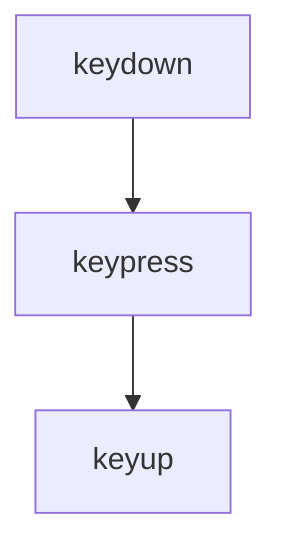

# Lección 03: Eventos de Teclado

Los eventos de teclado nos permiten interactuar con lo que el usuario escribe o presiona. Son fundamentales para formularios, juegos y atajos de teclado.

## Principales Eventos
1. **`keydown`:** Se dispara en el momento en que se presiona la tecla.
2. **`keypress`:** Se dispara cuando la tecla se mantiene presionada (genera un carácter).
3. **`keyup`:** Se dispara cuando el usuario suelta la tecla.



## Propiedades Útiles
- **`event.key`:** Devuelve el carácter presionado (ej: "a", "Enter").
- **`event.code`:** Devuelve el código físico de la tecla (ej: "KeyA", "Digit1").
- **`event.keyCode`:** (Legacy) El código numérico de la tecla.

### Ejemplo: Filtrar solo números en un Input
Podemos usar `event.preventDefault()` para cancelar la entrada si la tecla no es un número.

```javascript
campo.addEventListener('keydown', function(event) {
    // Bloquear si no es un número (códigos 48-57 en el teclado)
    if(event.keyCode < 48 || event.keyCode > 57) {
        event.preventDefault();
        console.warn("Solo se permiten números");
    }
});
```

### Capturar el Valor Final
Normalmente usamos `keyup` para capturar el valor después de que la tecla ha sido procesada.

```javascript
campo.addEventListener('keyup', function(event) {
    console.log("Contenido actual: " + event.target.value);
});
```

---
[[12-02-addEventListener|<- Anterior]] | [[00-indice-curso|Índice]] | [[12-04-eventos-raton|Siguiente ->]]
