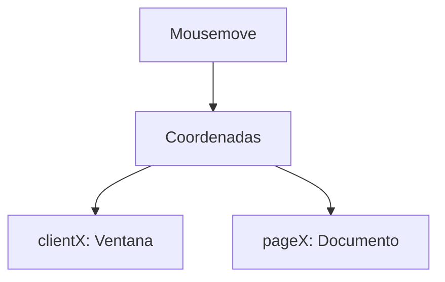

# Lección 04: Eventos de Ratón

Los eventos de ratón permiten que la interfaz reaccione al movimiento y las acciones físicas del puntero sobre los elementos.

## Eventos Comunes
- **`click`:** El más usado, ocurre al presionar y soltar el botón izquierdo.
- **`mouseover` / `mouseenter`:** Ocurre cuando el ratón entra en el área de un elemento.
- **`mouseout` / `mouseleave`:** Ocurre cuando el ratón sale del área de un elemento.
- **`mousemove`:** Se dispara constantemente mientras el ratón se mueve.

### Ejemplo: Mostrar un Menú al pasar el ratón
```javascript
let boton = document.getElementById('miBoton');
let menu = document.getElementById('miMenu');

boton.addEventListener('mouseover', () => menu.style.display = 'block');
boton.addEventListener('mouseout', () => menu.style.display = 'none');
```

## Coordenadas del Ratón
El objeto `event` nos da la posición exacta del cursor:
- **`clientX` / `clientY`:** Posición relativa a la ventana del navegador (viewport).
- **`pageX` / `pageY`:** Posición relativa a todo el documento (incluyendo el scroll).

```javascript
document.addEventListener('mousemove', function(event) {
    console.log(`X: ${event.clientX}, Y: ${event.clientY}`);
});
```



### Aplicaciones Comunes
- Menús desplegables (hovers).
- Tooltips (información emergente).
- Arrastrar y soltar (Drag and Drop).
- Seguimiento del cursor para efectos visuales.

---
[[12-03-eventos-teclado|<- Anterior]] | [[00-indice-curso|Índice]] | [[12-05-eventos-tiempo-real|Siguiente ->]]
