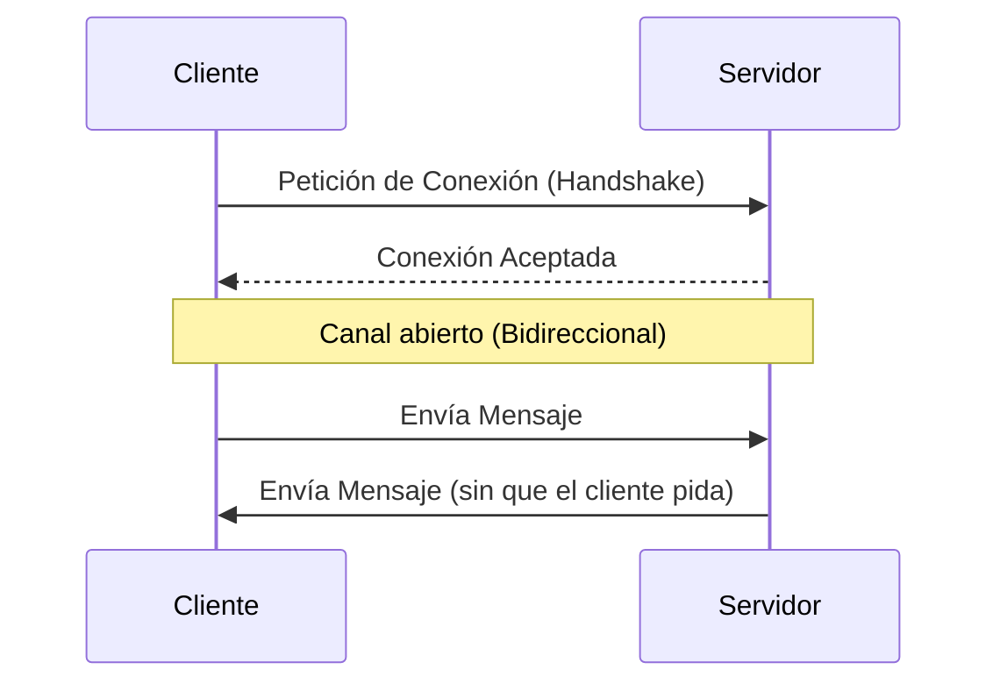

# Lección 05: Eventos en Tiempo Real (WebSockets)

A diferencia de las peticiones tradicionales (donde el cliente pide y el servidor responde), los **WebSockets** permiten una comunicación bidireccional y constante. Esto es vital para chats, notificaciones en vivo y juegos multijugador.

## ¿Qué es un WebSocket?
Es un protocolo que mantiene una conexión abierta entre el navegador y el servidor.



## Manejo de Eventos de Socket
Los WebSockets tienen sus propios eventos específicos:

1. **`onopen`:** Ocurre cuando la conexión se establece.
2. **`onmessage`:** Ocurre cuando el servidor envía datos al cliente.
3. **`onerror`:** Ocurre si hay un problema en la conexión.
4. **`onclose`:** Ocurre cuando la conexión se cierra.

### Ejemplo: Chat Básico
```javascript
let socket = new WebSocket('ws://servidor-de-chat:8080');

// Escuchar mensajes del servidor
socket.onmessage = function(event) {
    let contenido = event.data;
    console.log("Nuevo mensaje: " + contenido);
};

// Enviar un mensaje
function enviar() {
    let mensaje = document.getElementById("txt").value;
    socket.send(mensaje);
}
```

## Diferencia con Fetch
- **Fetch:** El cliente debe preguntar "¿hay algo nuevo?" (Polling).
- **WebSockets:** El servidor le dice al cliente "¡aquí tienes algo nuevo!" de forma inmediata (Push).

---
[[12-04-eventos-raton|<- Anterior]] | [[00-indice-curso|Índice]] | [[12-06-eventos-canvas|Siguiente ->]]
