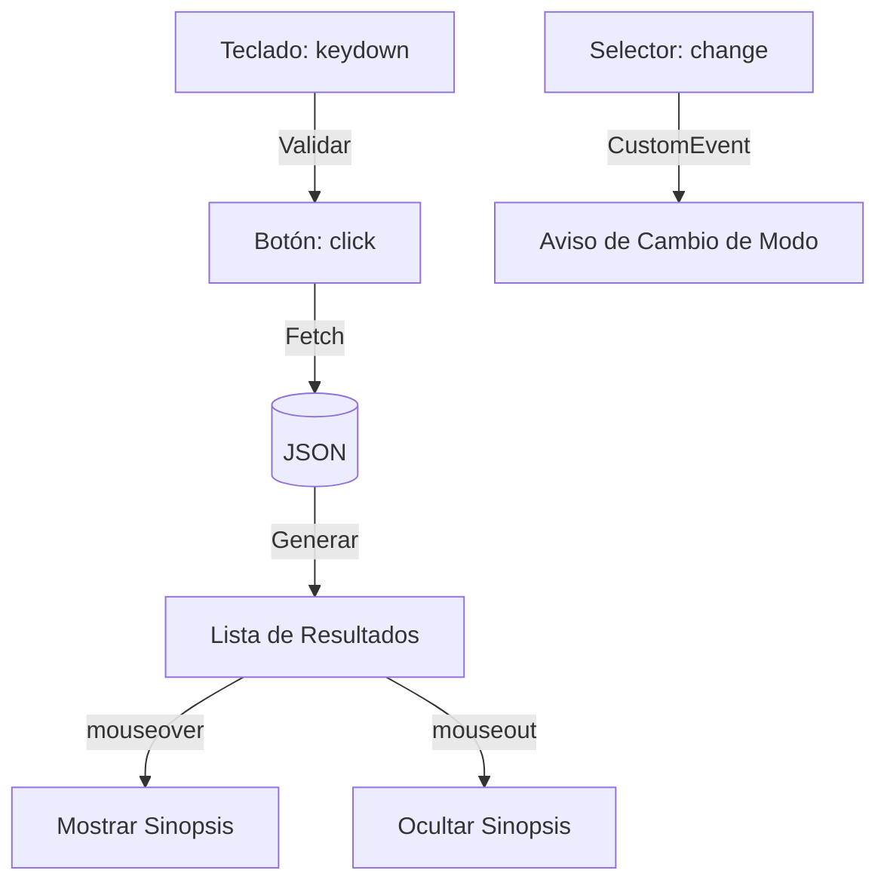

# Lección 08: Proyecto - Buscador de Películas

Este proyecto combina **Eventos**, **Fetch**, **JSON** y **Manipulación del DOM** para crear una herramienta de búsqueda interactiva.

## Objetivo
Crear un buscador que filtre películas o series desde un archivo JSON local, reaccione en tiempo real al teclado y muestre información adicional al pasar el ratón (hover).

## Características Implementadas
1. **Eventos de Teclado:** Se valida que el usuario solo ingrese letras y espacios en el buscador.
2. **Fetch Dinámico:** El usuario puede cambiar entre buscar en `peliculas.json` o `series.json`.
3. **Eventos Personalizados:** Se dispara un evento `cambioModo` cuando el usuario cambia el selector de búsqueda.
4. **Interactividad de Ratón:** Al pasar el ratón sobre un resultado, se muestra la sinopsis oculta.

## Lógica Principal

### Validación de Entrada
```javascript
function verificarInput(evento) {
    // Solo permitir letras (A-Z), espacio (32) y borrar (8)
    if((evento.keyCode < 65 || evento.keyCode > 90) && evento.keyCode != 32 && evento.keyCode != 8) {
        evento.preventDefault();
    }
}
```

### Búsqueda y Filtrado
```javascript
function buscar() {
    fetch(archivo)
    .then(res => res.json())
    .then(salida => {
        for(let item of salida.data) {
            // Filtrar por coincidencia al inicio del nombre
            if(item.nombre.startsWith(input.value.toUpperCase())) {
                crearElementoLista(item);
            }
        }
    });
}
```

## Diagrama de Interacción de Eventos



### Conceptos Clave Reforzados
- **`startsWith()`:** Método de strings para filtrar coincidencias.
- **Creación dinámica:** Uso de `document.createElement` para inyectar resultados.
- **Ámbito (Scope):** Gestión de variables como `archivo` que cambian según la interacción del usuario.

---
[[12-07-eventos-personalizados|<- Anterior]] | [[00-indice-curso|Índice]] | [[Módulo 13: Promesas|Siguiente Parte (Módulo 13) ->]]
