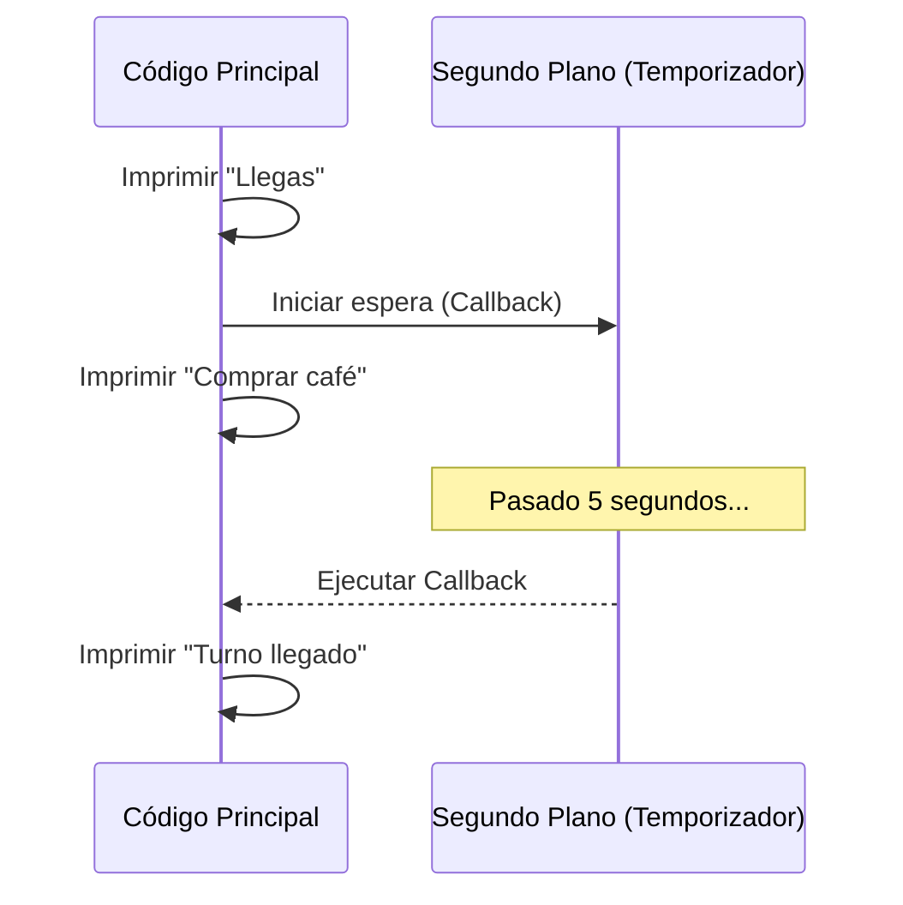

# Lección 01: Entendiendo los Callbacks

Un **Callback** es una función que se pasa como argumento a otra función para ser ejecutada más tarde, generalmente después de que se complete una operación asíncrona.

## La Analogía de la Fila
Imagina que llegas a un banco. En lugar de quedarte parado esperando en la ventanilla (bloqueando tu tiempo), dejas tu número y te vas a comprar un café. Cuando llega tu turno, te llaman (ejecutan el callback).

### Ejemplo de Código
```javascript
function avanzaFila(callback) {
    // Simulamos una espera de 5 segundos
    setTimeout(function() {
        console.log("Tu turno ha llegado");
        callback(); // Llamamos a la función recibida
    }, 5000);
}

function presentarse() {
    console.log("Te presentas a la ventanilla");
}

console.log("Llegas al banco");
avanzaFila(presentarse);
console.log("Te vas a comprar un café");
```

## Flujo de Ejecución (No Bloqueante)
1. Se imprime "Llegas al banco".
2. Se inicia `avanzaFila` (un temporizador de 5s en segundo plano).
3. **Inmediatamente** se imprime "Te vas a comprar un café" (el código no se detiene).
4. A los 5 segundos, se activa el callback y se imprime "Tu turno ha llegado" y "Te presentas a la ventanilla".



## El problema de los Callbacks: "Callback Hell"
Cuando anidamos muchos callbacks dentro de otros, el código se vuelve difícil de leer y mantener. Para solucionar esto, surgieron las **Promesas**.

---
[[12-08-buscador-peliculas|<- Anterior]] | [[00-indice-curso|Índice]] | [[13-02-promesas|Siguiente ->]]
