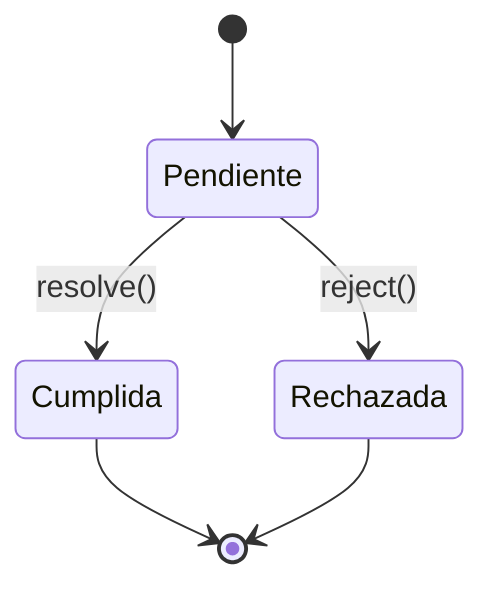

# Lección 02: Qué son las Promesas

Una **Promesa** es un objeto que representa el resultado eventual de una operación asíncrona. Puede estar en uno de tres estados:
1. **Pending (Pendiente):** Estado inicial, ni cumplida ni rechazada.
2. **Fulfilled (Cumplida):** La operación se completó con éxito (`resolve`).
3. **Rejected (Rechazada):** La operación falló (`reject`).

## Estructura de una Promesa
```javascript
let miPromesa = new Promise(function(resolve, reject) {
    if (todo_bien) {
        resolve("Éxito");
    } else {
        reject("Error");
    }
});
```

### Ejemplo: Petición de Datos
```javascript
function obtenerUsuarios() {
    return new Promise((resolve, reject) => {
        let xhr = new XMLHttpRequest();
        xhr.open('GET', 'https://api.com/users');
        xhr.onload = () => {
            if(xhr.status === 200) resolve(JSON.parse(xhr.response));
            else reject("Error de servidor");
        };
        xhr.send();
    });
}

// Uso de la promesa
obtenerUsuarios()
    .then(usuarios => console.log(usuarios)) // Maneja el resolve
    .catch(error => console.error(error));    // Maneja el reject
```

## Ventajas sobre los Callbacks
- **Legibilidad:** El código es más plano y lineal.
- **Manejo de Errores Centralizado:** Un solo `.catch()` puede capturar errores de toda una cadena de promesas.
- **Encadenamiento:** Podemos retornar una nueva promesa en un `.then()` y seguir el flujo.



---
[[13-01-callbacks|<- Anterior]] | [[00-indice-curso|Índice]] | [[13-03-async-await|Siguiente ->]]
