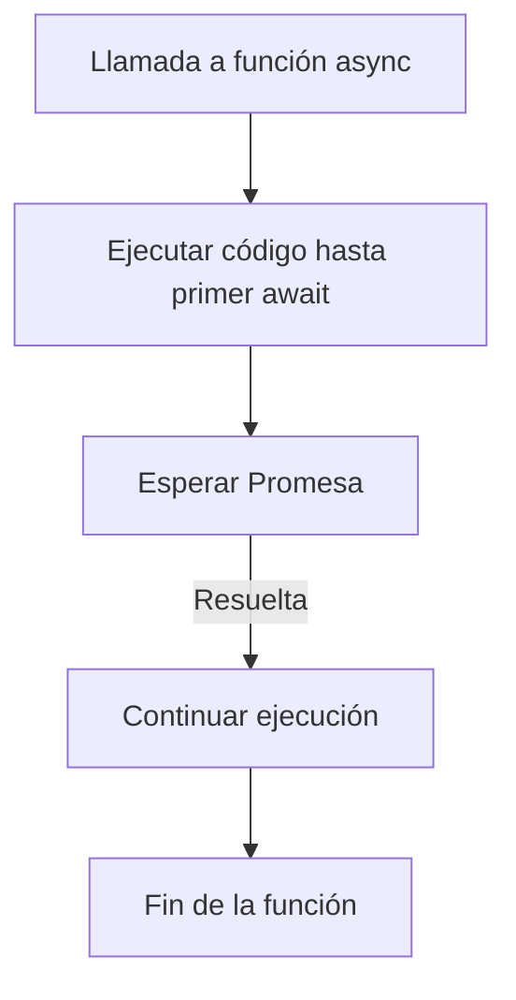

# Lección 03: Async / Await

La sintaxis **Async/Await** es una mejora sobre las promesas que permite escribir código asíncrono que se lee y se comporta de manera muy similar al código síncrono.

## ¿Cómo se usa?
1. **`async`:** Se coloca antes de la definición de una función. Indica que la función siempre devolverá una promesa.
2. **`await`:** Solo se puede usar dentro de una función `async`. Detiene la ejecución de la función hasta que la promesa se resuelva.

### Ejemplo: Peticiones Secuenciales
Sin `await`, tendríamos múltiples `.then()` anidados. Con `await`, el código es lineal:

```javascript
async function obtenerInformacion() {
    console.log("Iniciando búsqueda...");

    // Esperamos a que la petición termine
    let respuesta = await fetch('https://api.ejemplo.com/datos');
    let datos = await respuesta.json();

    console.log("Datos recibidos:", datos);
    console.log("Fin del proceso.");
}

obtenerInformacion();
```

## Flujo de Trabajo
Aunque parezca que el código se "detiene", lo que realmente sucede es que la función se suspende mientras el navegador sigue atendiendo otros eventos.



## Beneficios
- **Legibilidad:** Elimina el "ruido" de los `.then()`.
- **Debugging:** Es más fácil poner puntos de interrupción (breakpoints) y seguir el flujo.
- **Estructura:** Facilita el uso de bloques `try...catch` tradicionales para manejar errores.

---
[[13-02-promesas|<- Anterior]] | [[00-indice-curso|Índice]] | [[13-04-manejo-errores|Siguiente ->]]
