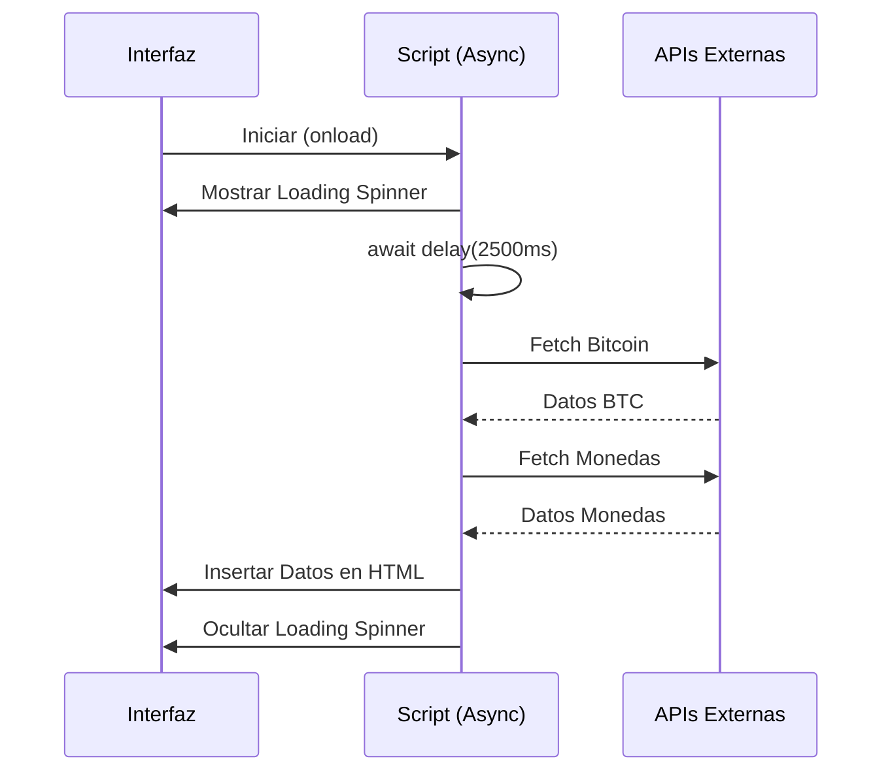

# Lección 05: Proyecto - Cotizaciones de Criptomonedas

Este proyecto final del módulo utiliza múltiples técnicas de asincronía (`async/await`, `Promises`, `Fetch`) para obtener datos de diferentes APIs financieras y mostrarlos en tiempo real, simulando un tiempo de carga con un "spinner" o imagen de espera.

## Arquitectura del Proyecto
El sistema realiza tres peticiones diferentes de forma secuencial y coordinada:
1. Precio del Bitcoin (vía `fetch`).
2. Cotización USD/EUR (vía `fetch`).
3. Cotización USD/ARS (vía una Promesa personalizada con `XMLHttpRequest`).

## Lógica de Asincronía

### 1. Función Delay Personalizada
Creamos nuestra propia promesa para simular un retraso en la carga.
```javascript
function delay(ms) {
    return new Promise(res => setTimeout(res, ms));
}
```

### 2. Coordinación con Async/Await
```javascript
async function cargarCotizaciones() {
    // 1. Mostrar espera
    await delay(2500); 

    // 2. Obtener Bitcoin
    let res1 = await fetch('https://api.coindesk.com/...');
    let datos1 = await res1.json();
    
    // 3. Obtener Monedas (Secuencial)
    let res2 = await fetch('https://open.er-api.com/...');
    // ... procesar datos

    // 4. Ocultar imagen de espera
    document.getElementById('imgEspera').style.visibility = 'hidden';
}
```

## Flujo de Trabajo del Proyecto



### Conceptos Clave Reforzados
- **Simulación de Carga:** Uso de promesas para controlar el tiempo (`delay`).
- **Encadenamiento Secuencial:** El uso de `await` asegura que una cotización se cargue después de la otra de forma ordenada.
- **Peticiones Manuales:** Creación de promesas envolviendo `XMLHttpRequest` para entender cómo funcionan las librerías internamente.

---
[[13-04-manejo-errores|<- Anterior]] | [[00-indice-curso|Índice]] | [[Módulo 14: Frameworks|Siguiente Parte (Parte 5) ->]]
