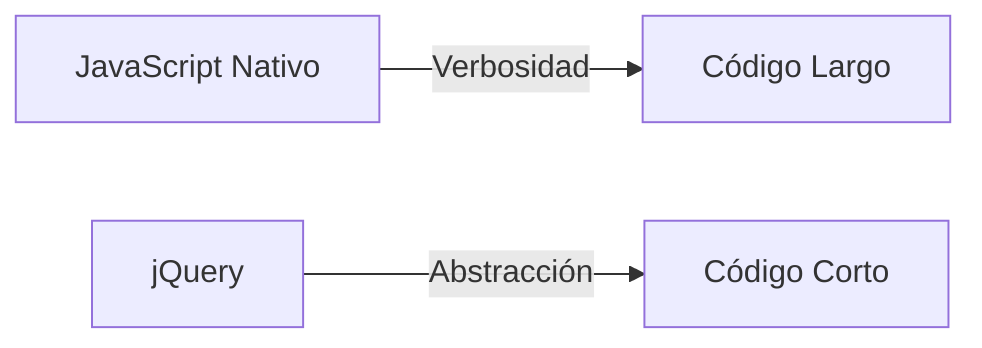

# Lección 01: jQuery y la manipulación del DOM

**jQuery** es una de las librerías más famosas de JavaScript. Aunque hoy en día muchas de sus funciones ya están integradas en el lenguaje nativo (Vanilla JS), sigue siendo fundamental entenderla por la gran cantidad de proyectos que aún la utilizan.

## ¿Qué hace jQuery?
Su lema es *"Write less, do more"* (Escribe menos, haz más). Simplifica tareas comunes como la selección de elementos, el manejo de eventos y las animaciones.

### Sintaxis del Selector `$`
En lugar de usar `document.getElementById` o `document.querySelector`, jQuery utiliza el símbolo de dólar `$`.

```javascript
// Esperar a que el documento esté listo
$(document).ready(function() {
    
    // Seleccionar por etiqueta y manejar el click
    $("button").click(function() {
        
        // Obtener el valor de un input
        let valor = $("#miInput").val(); 
        alert("El valor es: " + valor);
        
    });
});
```

## Comparativa: Vanilla JS vs jQuery

| Tarea | Vanilla JS | jQuery |
| :--- | :--- | :--- |
| **Seleccionar** | `document.querySelector('#id')` | `$('#id')` |
| **Evento Click** | `el.addEventListener('click', ...)` | `el.click(...)` |
| **Obtener Valor** | `input.value` | `input.val()` |
| **Modificar CSS** | `el.style.color = 'red'` | `el.css('color', 'red')` |



### ¿Cuándo usar jQuery?
- Cuando trabajas en proyectos legados (WordPress, sitios antiguos).
- Cuando necesitas compatibilidad extrema con navegadores muy viejos.
- Para prototipado rápido de animaciones complejas.

---
[[13-05-cotizaciones|<- Anterior]] | [[00-indice-curso|Índice]] | [[14-02-axios|Siguiente ->]]
