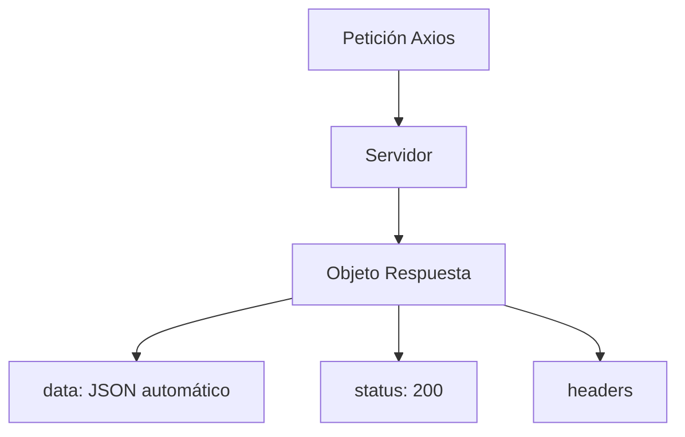

# Lección 02: Peticiones con Axios

**Axios** es una librería basada en promesas para realizar peticiones HTTP. Aunque ya conocemos `fetch`, Axios es muy popular en el desarrollo profesional (especialmente con frameworks como React o Vue) debido a sus funcionalidades adicionales y su facilidad de uso.

## Ventajas de Axios sobre Fetch
1. **Transformación automática:** Convierte los datos a JSON automáticamente (no necesitas hacer `.json()`).
2. **Compatibilidad:** Funciona tanto en el navegador como en Node.js.
3. **Interceptores:** Permite ejecutar código antes de que la petición se envíe o después de recibir la respuesta.
4. **Manejo de errores:** Lanza errores automáticamente para códigos de estado fuera del rango 2xx.

### Ejemplo: Petición GET
```javascript
function obtenerInformacion() {
    axios.get('https://api.ejemplo.com/posts')
        .then(function(respuesta) {
            // "respuesta.data" ya es un objeto JS procesado
            let posts = respuesta.data;
            console.log(posts[0].title);
        })
        .catch(function(error) {
            console.error("Hubo un error: ", error);
        });
}
```

## Estructura de la Respuesta
Cuando recibes una respuesta de Axios, el objeto contiene:
- `data`: El contenido de la respuesta (el cuerpo).
- `status`: El código HTTP (200, 404, etc.).
- `headers`: Los encabezados enviados por el servidor.



---
[[14-01-jquery|<- Anterior]] | [[00-indice-curso|Índice]] | [[14-03-mi-banco-v2|Siguiente ->]]
