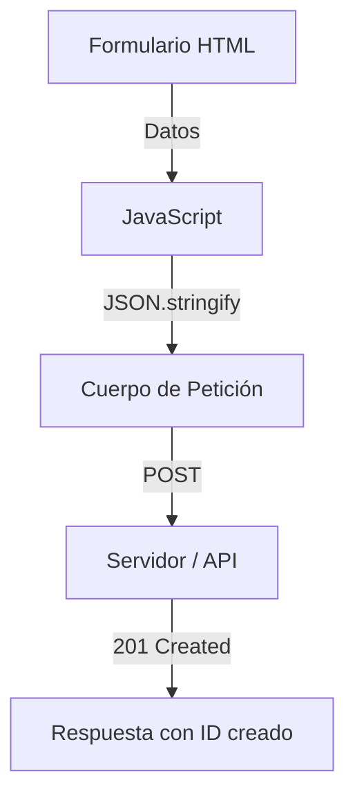

# Lección 01: Solicitudes POST

Hasta ahora hemos usado peticiones `GET` para obtener datos. La solicitud **POST** se utiliza para enviar datos al servidor, por ejemplo, al crear un nuevo usuario, publicar un comentario o registrar un producto.

## Estructura de una petición POST con Fetch
A diferencia de GET, en una petición POST debemos configurar el objeto de opciones de `fetch()`:

1. **`method`**: Especificamos `"POST"`.
2. **`headers`**: Debemos indicar que estamos enviando JSON con `"Content-Type": "application/json"`.
3. **`body`**: Contiene los datos, convertidos a texto con `JSON.stringify()`.

```javascript
async function crearUsuario(nombre, email) {
    let respuesta = await fetch('https://api.ejemplo.com/users', {
        method: 'POST',
        headers: {
            'Content-Type': 'application/json'
        },
        body: JSON.stringify({
            username: nombre,
            userEmail: email
        })
    });

    let data = await respuesta.json();
    console.log("Usuario creado:", data);
}
```

## Flujo de Datos en POST



### Diferencias Clave
- **GET:** Los datos viajan en la URL (query params). Es menos seguro para datos sensibles.
- **POST:** Los datos viajan en el "cuerpo" (body) de la petición. No tiene límite de tamaño.

---
[[14-03-mi-banco-v2|<- Anterior]] | [[00-indice-curso|Índice]] | [[15-02-verbos-http|Siguiente ->]]
