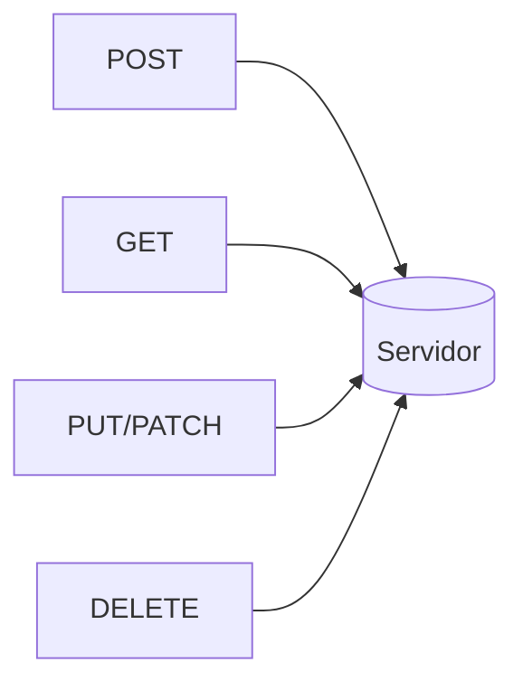

# Lección 02: Otros Verbos (PUT, DELETE, PATCH)

Además de GET y POST, el protocolo HTTP define otros verbos (o métodos) para realizar diferentes acciones sobre los recursos en un servidor. Estos siguen la arquitectura **REST**.

## 1. PUT (Actualizar)
Se utiliza para reemplazar un recurso existente por completo con nuevos datos.

```javascript
fetch('https://api.com/posts/5', {
    method: 'PUT',
    headers: { 'Content-Type': 'application/json' },
    body: JSON.stringify({ title: 'Título Actualizado', body: 'Contenido completo' })
});
```

## 2. PATCH (Modificación Parcial)
A diferencia de PUT, PATCH solo actualiza los campos que enviamos, dejando el resto del recurso intacto.

```javascript
fetch('https://api.com/posts/5', {
    method: 'PATCH',
    headers: { 'Content-Type': 'application/json' },
    body: JSON.stringify({ title: 'Solo cambio el título' })
});
```

## 3. DELETE (Eliminar)
Se utiliza para borrar un recurso específico. Generalmente no requiere un `body`.

```javascript
fetch('https://api.com/posts/5', {
    method: 'DELETE'
})
.then(res => console.log("Eliminado con éxito"));
```

## Resumen de Verbos HTTP (CRUD)

| Verbo | Acción CRUD | Descripción |
| :--- | :--- | :--- |
| **GET** | Read (Leer) | Obtener información. |
| **POST** | Create (Crear) | Crear un nuevo recurso. |
| **PUT** | Update (Actualizar) | Reemplazar un recurso. |
| **PATCH** | Update (Actualizar) | Modificar parte de un recurso. |
| **DELETE** | Delete (Borrar) | Eliminar un recurso. |



---
[[15-01-post|<- Anterior]] | [[00-indice-curso|Índice]] | [[15-03-fetch-axios-avanzado|Siguiente ->]]
