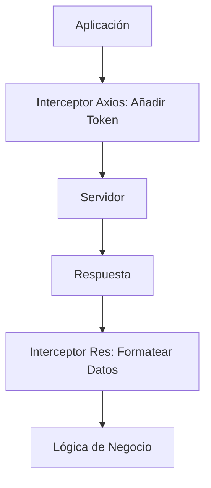

# Lección 03: Fetch y Axios en detalle

Para aplicaciones profesionales, necesitamos configurar opciones avanzadas como la seguridad (Tokens), el manejo de múltiples peticiones simultáneas y la interceptación de datos.

## 1. Configuración de Headers (Autorización)
Muchas APIs requieren un "Token" de seguridad para permitir el acceso. Usualmente se envía en el encabezado `Authorization`.

```javascript
fetch(url, {
    headers: {
        'Authorization': 'Bearer ' + miToken,
        'Content-Type': 'application/json'
    }
});
```

## 2. Interceptores en Axios
Los interceptores permiten "espiar" o modificar cada petición o respuesta antes de que llegue a su destino. Es ideal para añadir tokens automáticamente a todas las llamadas.

```javascript
// Interceptar Petición
axios.interceptors.request.use(config => {
    config.headers.Authorization = `Bearer ${token}`;
    return config;
});
```

## 3. Múltiples Peticiones Simultáneas (`Promise.all`)
Si necesitamos datos de tres lugares diferentes al mismo tiempo, podemos usar `Promise.all` para esperar a que todas terminen.

```javascript
let p1 = axios.get(url1);
let p2 = axios.get(url2);

Promise.all([p1, p2])
    .then(([res1, res2]) => {
        console.log("Datos 1:", res1.data);
        console.log("Datos 2:", res2.data);
    });
```

## Flujo Avanzado de Peticiones



---
[[15-02-verbos-http|<- Anterior]] | [[00-indice-curso|Índice]] | [[15-04-administracion-productos|Siguiente ->]]
