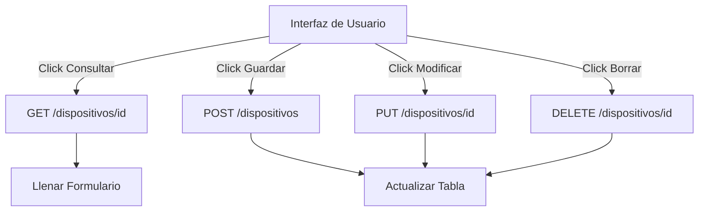

# Lección 04: Proyecto - Administración de Productos

Este proyecto es una aplicación **CRUD** (Create, Read, Update, Delete) completa que interactúa con una API REST simulada para gestionar un inventario de teléfonos móviles.

## Objetivos del Proyecto
1. **Listar:** Obtener todos los productos del servidor y mostrarlos en una tabla.
2. **Consultar:** Buscar un producto específico por su ID.
3. **Agregar:** Enviar un nuevo producto al servidor mediante `POST`.
4. **Modificar:** Actualizar la información de un producto con `PUT`.
5. **Eliminar:** Quitar un producto del registro usando `DELETE`.

## Implementación Técnica

### 1. Listado con Fetch (GET)
Recorremos los datos y generamos filas de tabla (`<tr>`) dinámicamente.
```javascript
async function obtenerTodos() {
    let respuesta = await fetch(url);
    let data = await respuesta.json();
    // Generar HTML con un bucle for...of
}
```

### 2. Búsqueda y Modificación (GET + PUT)
Primero consultamos los datos para llenar el formulario y luego enviamos los cambios.
```javascript
// Modificar
fetch(url + id, {
    method: 'PUT',
    headers: { "Content-Type": "application/json" },
    body: JSON.stringify(datosEditados)
});
```

### 3. Eliminación con Axios (DELETE)
Utilizamos Axios para simplificar la sintaxis de eliminación.
```javascript
async function eliminarUno(id) {
    await axios.delete(url + id);
    alert("Eliminado");
    obtenerTodos(); // Refrescar lista
}
```

## Arquitectura CRUD en el Cliente



### Notas Importantes
- **Simulación:** Al usar `my-json-server`, los cambios no se guardan permanentemente en el servidor real, pero la respuesta de la API simula el éxito de la operación.
- **Validación:** Se incluyeron alertas para evitar procesar campos vacíos.

---
[[15-03-fetch-axios-avanzado|<- Anterior]] | [[00-indice-curso|Índice]] | [[Módulo 16: Bases de Datos|Siguiente Parte (Módulo 16) ->]]
