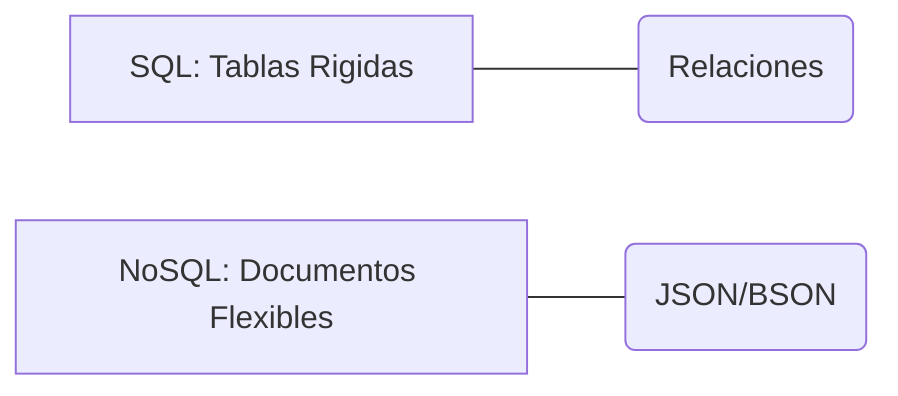
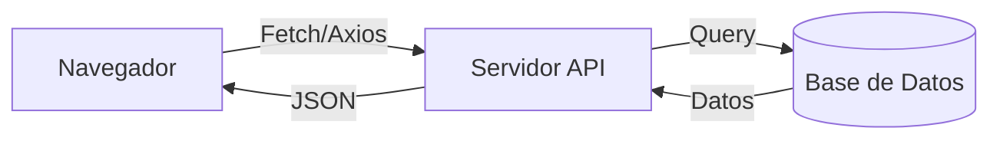

# Lección 01: Introducción a Bases de Datos

En el desarrollo de aplicaciones web reales, los datos no se guardan en archivos JSON locales, sino en **Bases de Datos** (DB). Estas permiten almacenar, organizar y consultar grandes volúmenes de información de forma eficiente y segura.

## Tipos de Bases de Datos

### 1. Relacionales (SQL)
Organizan los datos en tablas con filas y columnas, relacionadas entre sí mediante llaves.
- **Ejemplos:** MySQL, PostgreSQL, SQL Server.
- **Uso:** Datos estructurados con relaciones claras (ej: un cliente tiene muchos pedidos).

### 2. No Relacionales (NoSQL)
Almacenan datos en formatos más flexibles, como documentos JSON.
- **Ejemplos:** MongoDB, Cassandra, Redis.
- **Uso:** Datos que cambian frecuentemente o que no tienen una estructura rígida.

## El Intermediario: El Backend
El navegador (Frontend) nunca debe conectarse directamente a la base de datos por razones de seguridad. Necesitamos un servidor intermedio (**Backend**) que gestione las peticiones.

### Conceptos Fundamentales
- **Motor de DB:** El software que gestiona los datos (ej: MySQL).
- **Query (Consulta):** El comando para pedir datos (ej: `SELECT * FROM usuarios`).
- **Persistencia:** La capacidad de los datos de sobrevivir después de cerrar la aplicación.

---
[[15-04-administracion-productos|<- Anterior]] | [[00-indice-curso|Índice]] | [[16-02-consideraciones|Siguiente ->]]
