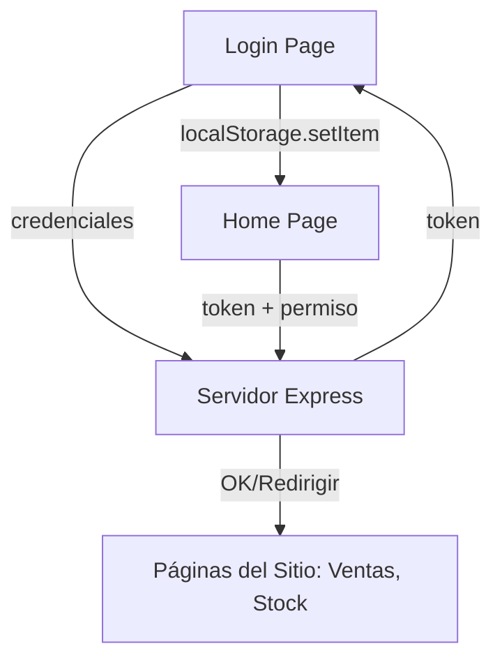

# Lección 01: Estructura del Proyecto Final

El proyecto final del curso consiste en una **Aplicación Web de Gestión** completa con sistema de autenticación. Integra todos los conocimientos del curso: HTML/CSS, Lógica de Negocio, POO, Asincronía y Conexión con Backend.

## Objetivos del Proyecto
- Implementar un sistema de **Login** seguro.
- Gestionar **Permisos de Usuario** (RBAC - Role Based Access Control).
- Utilizar **Tokens** para mantener la sesión activa.
- Realizar peticiones protegidas a un servidor Node.js/Express.

## Arquitectura de la Aplicación

### El Rol de LocalStorage
`localStorage` es una pequeña base de datos dentro del navegador que nos permite guardar información incluso si cerramos la pestaña.
- **Uso:** Guardar el Token que el servidor nos entrega al loguearnos.
- **Acceso:** `localStorage.getItem('token')` y `localStorage.setItem('token', valor)`.

---
[[16-02-consideraciones|<- Anterior]] | [[00-indice-curso|Índice]] | [[17-02-login-seguridad|Siguiente ->]]
