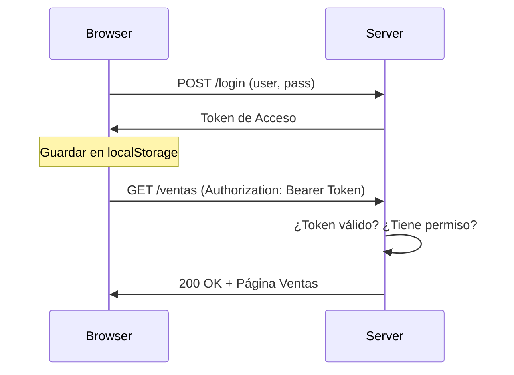

# Lección 02: Login y Protección de Datos

En esta lección final, implementamos la lógica de autenticación y la navegación protegida. El servidor no solo verifica quién eres, sino también a qué tienes derecho a acceder.

## 1. El Proceso de Login
Cuando el usuario envía sus datos, el servidor devuelve una cadena de texto (Token). Este token es nuestra "llave maestra" para el resto de la sesión.

```javascript
function login() {
    let user = document.getElementById("txtUsuario").value;
    let pass = document.getElementById("txtPass").value;

    fetch('http://localhost:3000/login', {
        method: 'POST',
        headers: { "Content-Type": "application/json" },
        body: JSON.stringify({ user, pass })
    })
    .then(res => res.text())
    .then(token => {
        if(token) {
            // Guardamos la llave para usarla después
            localStorage.setItem('token', token);
            window.location.href = "home.html";
        } else {
            alert("Acceso denegado");
        }
    });
}
```

## 2. Validación de Permisos
Cada vez que el usuario intenta entrar a una sección (ej: Ventas), enviamos el token en los encabezados de la petición.

```javascript
function validarAcceso(pagina) {
    const token = localStorage.getItem('token');
    
    fetch('http://localhost:3000/validate', {
        method: 'POST',
        headers: {
            "Content-Type": "application/json",
            "Authorization": `Bearer ${token}` // Enviamos el token
        },
        body: JSON.stringify({ permiso: pagina })
    })
    .then(res => res.text())
    .then(data => {
        if(data) window.location.href = data; // Redirigir a la página
        else alert("No tienes permiso para ver esta sección");
    });
}
```

## Diagrama de Seguridad (Tokens)



### Conclusión del Curso
Has pasado de escribir tu primer `alert("Hola Mundo")` a construir un sistema con arquitectura cliente-servidor, seguridad por tokens y gestión de bases de datos. ¡Felicidades por completar este camino!

---
[[17-01-proyecto-final|<- Anterior]] | [[00-indice-curso|Índice]] | [[18-01-modulos|Siguiente ->]]
