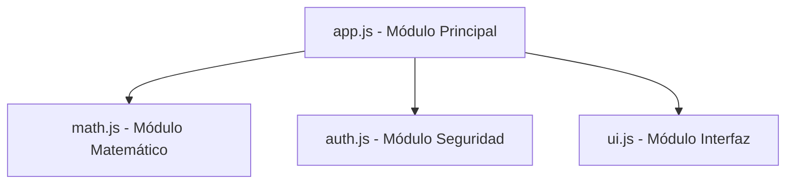

# Lección 01: Módulos en JavaScript

A medida que nuestras aplicaciones crecen, tener todo el código en un solo archivo se vuelve inmanejable. Los **Módulos** nos permiten dividir el código en archivos separados e importar solo lo que necesitamos.

## ¿Cómo funcionan los Módulos?
Se basan en dos palabras clave fundamentales: `export` (para compartir código) e `import` (para traer código de otros archivos).

### 1. Exportar (Archivo: `funciones.js`)
```javascript
export function saludar(nombre) {
    console.log("Hola " + nombre);
}

export const PI = 3.1416;
```

### 2. Importar (Archivo: `app.js`)
```javascript
import { saludar, PI } from './funciones.js';

saludar("Federico");
console.log(PI);
```

## Requisitos en HTML
Para que el navegador entienda los módulos, debemos especificar `type="module"` en la etiqueta `<script>`.

```html
<script type="module" src="app.js"></script>
```

## Ventajas de usar Módulos
- **Mantenibilidad:** El código es más fácil de organizar y encontrar.
- **Ámbito (Scope):** Las variables de un módulo no contaminan el ámbito global de otros módulos.
- **Reutilización:** Puedes usar el mismo módulo en diferentes proyectos.



---
[[17-02-login-seguridad|<- Anterior]] | [[00-indice-curso|Índice]] | [[18-02-uso-estricto|Siguiente ->]]
