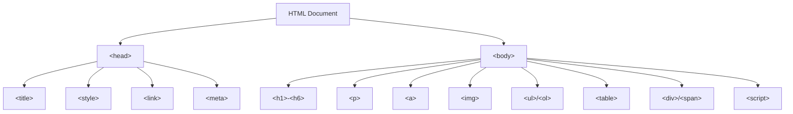
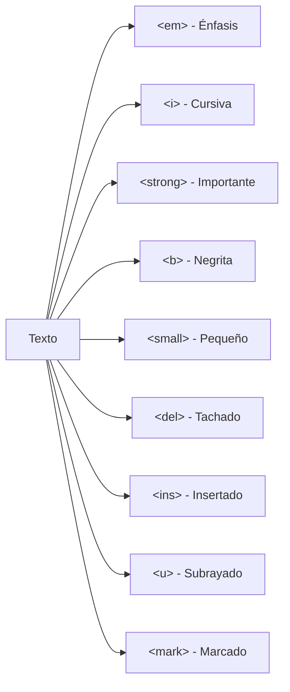
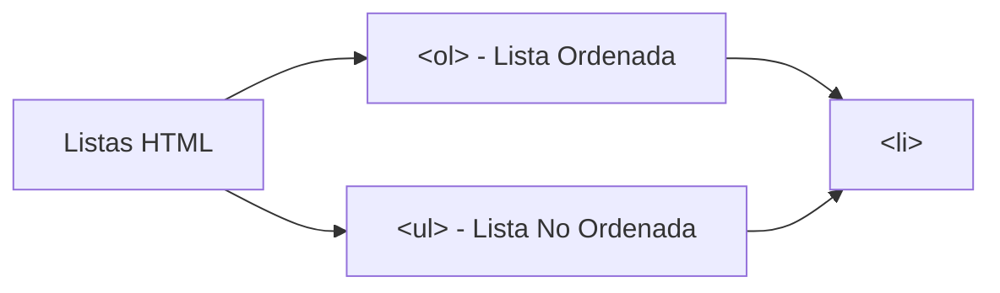
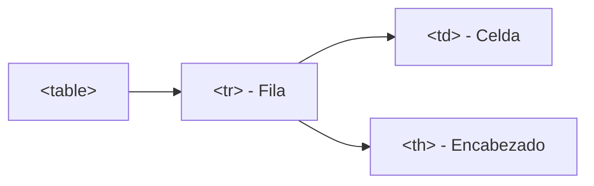

# Mi Primera Página

**Módulo:** `HTML Básico` | **Lección:** 01

Esto es un comentario

Un comentario es una linea de código que será ignorada por el navegador

pero nos ayuda a recordar que hace ciertas lineas de código

> 💡 *La estiqueta script permite escribir código dde JavaScript dentro de HTML*

# Bienvenido al curso de JavaScript

## El primer paso es el más grande

Esta página es muy sencilla, parece una web de los años 90, pero esta es la base minimalista
            para construir una web minima. 
Esta web está compuesta de 3 Etiquetas H1, H2 y P, 
            en la siguiente lección aprenderemos mas de estas etiquetas 
Posa el mouse sobre el título

(pero tiene un secreto >>> Presiona F12) 
 
Cuando acabes, regresa al menú principal y ve a la segunda lección

---

## 2-Etiquetas

Para ver como se esccriben las etiquetas, ve al inspector de elementos

---

## 3-Etiquetas Anidadas

> 💡 *Etiquetas anidadas*

> 💡 *Observe que dentro de una etiqueta hay otras etiquetas*

> 💡 *Un parrafo que contiene a su vez una palabra negrilla que dentro hay una etiqueta cursiva y subrayada*

Esto es un parrafo y dentro hay **una palabra resaltada y es cursiva y esta es subrayada**

Observe que dentro de una etiqueta hay otras etiquetas

Un parrafo que contiene a su vez una palabra negrilla que dentro hay una etiqueta cursiva y subrayada 
pero esto lo podrá observar mejor si lo vez en el inspector de elementos. 
Haz clic derecho en el párrafo para verlo.

---

## 4-Texto ordenado

> 💡 *Esto es un texto ordenado*

1. Prepara tu equipaje.
1. Compra tus boletos.
1. Dirígete al aeropuerto.
1. Disfruta del viaje. 🚀

Las listas ordenadas se hacen con las etiquetas <ol> para definir una lista ordenada y las etiquetas <li> para definir cada uno de los elementos de la lista.

Tambien hay listas no ordenadas, las etiquetas <ul> para definir una lista no ordenada y las etiquetas <li> para definir cada uno de los elementos de la lista.

---

## 5-Encabezados

> 💡 *Este es el titulo principal*

# Yo soy el más importante

> 💡 *Este es el segundo titulo*

## Soy el segundo

### Ahora sigo yo

#### El cuarto también cuenta

##### No me dejen último

###### Casi me quedo afuera

Yo soy un párrafo normal

---

## 6-Imágenes

{width=50%}

Los tucanes son aves de plumas y pico de colores muy llamativos. Miden 65 centímetros y pesan de 130 hasta 680 g. Su pico es largo con una longitud aproximada de 20 cm y alcanzando su talla definitiva después de varios meses. Tiene pequeños dientes como sierras, llega a medir la tercera parte de su tamaño y es muy ligero por las numerosas cámaras que tiene por lo que no le dificulta el vuelo. Su lengua es muy larga (llega a medir hasta 14 cm), angosta, aplanada y termina en punta. Tiene alas pequeñas, cortas y redondeadas. La cola es cuadrada en unas especies y llama la atención la facilidad con que la mueve hacia arriba y abajo. Los ojos están rodeados por una piel que a veces es de colores vivos y la vista es su sentido más desarrollado. Las patas son cortas y fuertes, facilitando la sujeción a las ramas y el desplazamiento entre árboles. No muestran dimorfismo sexual, los sexos son muy similares aunque la hembra presenta el pico ligeramente más pequeño y a veces más recto que el macho.

---

## 7-Enlaces

[Ir a Wikipedia](https://es.wikipedia.org/wiki/Tucán)

Los enlaces comienzan con la etiqueta <a>, seguido del parametro href y el enlace.

---

## 8-Tablas

Las tablas se crean con las etiquetas <table> y sus atributos border y cellpadding.

---

## 9-Crea tu propia biografia

La idea es aprovechar el conocimiento adquirido de esta super lección resumida para que crees tu propia biografia

Deberá contener tu nombre, fecha de nacimiento, lugar de nacimiento, nacionalidad, estado civil, educación, ocupación, idiomas

Si tienes hermanos, pareja y/o hijos

Algunos vinculos que separe lo que fue tu niñez, adolecencia y adultez

## 🧩 Código JavaScript

```javascript
//Esto es un comentario en JavaScript
            /*Esto es un comentario
            multilinea

            Vemos que hay una funcion que es un trozo de código que se carga en memoria, 
            esperando ser invocado
            */
            function ponerTituloRojo(){
                document.getElementById("titulo").style="color: red"
            }
            // En este caso la funcion ponerTituloRojo será invocado al posar el mouse sobre el titulo
```


## 📊 Diagrama Conceptual










## 🔗 Enlaces Relacionados

### En este módulo
- [[Mis etiquetas]]
- [[Etiquetas anidadas]]
- [[Texto ordenado]]
- [[Texto ordenado]]
- [[Agregar Imágenes]]
- [[Enlaces]]
- [[Mi Biografia]]
- [[Pagina 2]]
- [[Mi Biografia]]
- [[Mi Biografia]]
- [[Mi Biografia]]

### Navegación del curso
- ➡️ Módulo siguiente: [[HTML Intermedio]]
- 🏠 Volver al [[Índice del Curso]]
