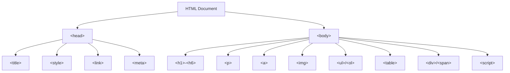
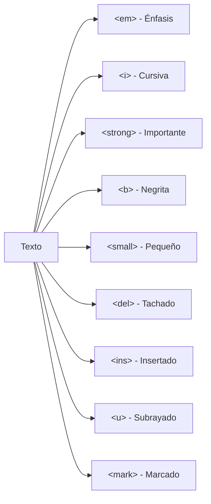
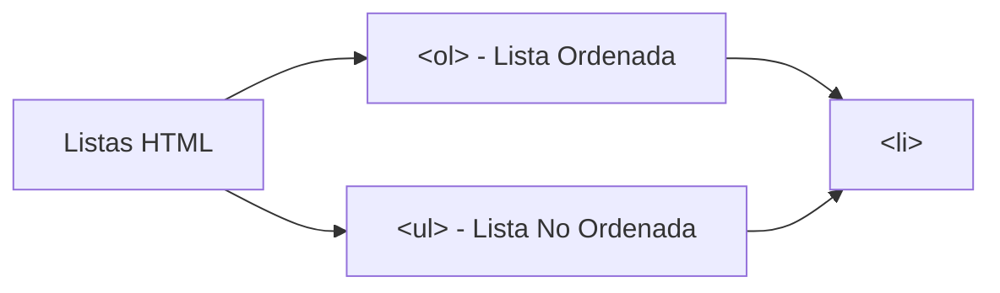
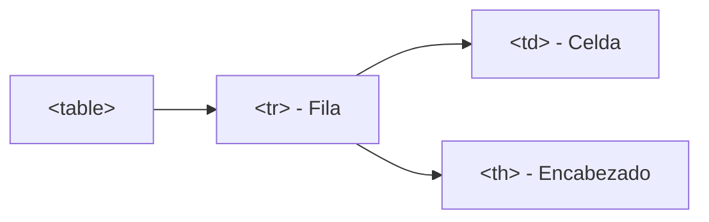

# Texto ordenado

**Módulo:** `HTML Básico` | **Lección:** 04

Esto es un texto ordenado

> 💡 *Esto es un texto ordenado*

1. Prepara tu equipaje.
1. Compra tus boletos.
1. Dirígete al aeropuerto.
1. Disfruta del viaje. 🚀

Las listas ordenadas se hacen con las etiquetas <ol> para definir una lista ordenada y las etiquetas <li> para definir cada uno de los elementos de la lista.

Tambien hay listas no ordenadas, las etiquetas <ul> para definir una lista no ordenada y las etiquetas <li> para definir cada uno de los elementos de la lista.

## 📊 Diagrama Conceptual

## 🔗 Enlaces Relacionados

### En este módulo
- [[Mi Primera Página]]
- [[Mis etiquetas]]
- [[Etiquetas anidadas]]
- [[Texto ordenado]]
- [[Agregar Imágenes]]
- [[Enlaces]]
- [[Mi Biografia]]
- [[Pagina 2]]
- [[Mi Biografia]]
- [[Mi Biografia]]
- [[Mi Biografia]]

### Navegación del curso
- ➡️ Módulo siguiente: [[HTML Intermedio]]
- 🏠 Volver al [[Índice del Curso]]
