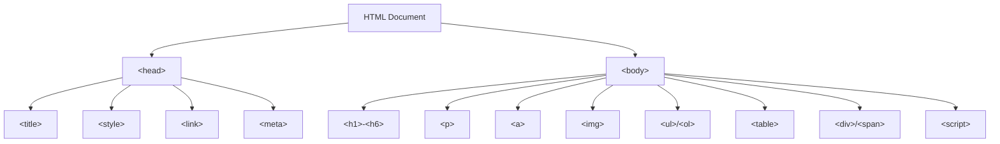
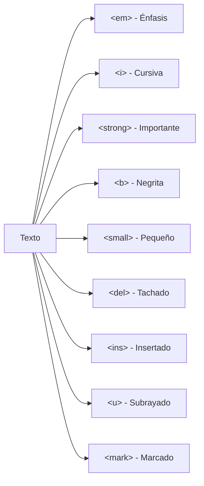
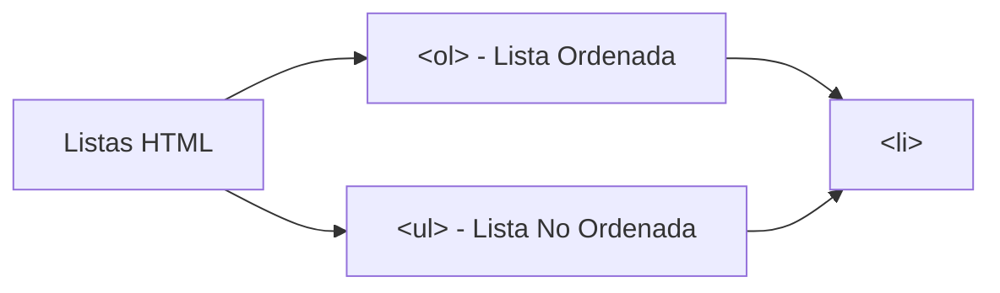
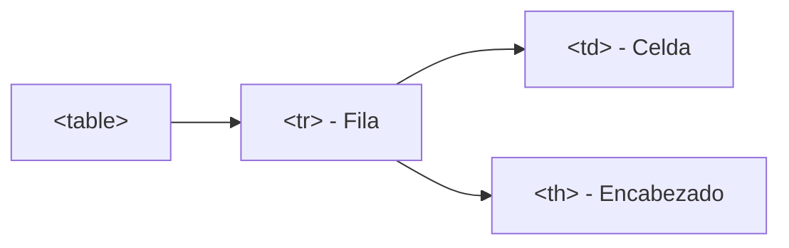

# Mi Biografia

**Módulo:** `HTML Básico` | **Lección:** adolescencia

# Federico Garay

## Mi biografía

### Adolescencia

{width=35%}

La mía fue una de las últimas generaciones en transcurrir la adolescencia sin internet ni smartphones. ¿eso fue mejor o peor? No pienso mucho en eso. Solo sé que era distinto. Para ver a mis amigos tenía que coordinar un punto de encuentro, pera conocer chicas tenía que… ¡hablarles de frente!, para escuchar la música que me gustaba tenía que comprar CDs o grabar los temas de la radio. 

Lo que más me gustaba hacer con mi tiempo era dibujar. Dibujaba mucho, y creo que bastante bien ¿Qué hice con aquél talento? Siempre digo que ya volveré a calentar la muñeca, pero nunca lo hago. 

Después de fracasar como futbolista en mi infancia descubrí el rugby en mi adolescencia… ¡en el que fracasé aún con más fuerza! Los deportes claramente no son lo mío. 

 [Inicio](index.html) 
 [Infancia](infancia.html)  [Adultez](adultez.html)

## 📊 Diagrama Conceptual

## 🔗 Enlaces Relacionados

### En este módulo
- [[Mi Primera Página]]
- [[Mis etiquetas]]
- [[Etiquetas anidadas]]
- [[Texto ordenado]]
- [[Texto ordenado]]
- [[Agregar Imágenes]]
- [[Enlaces]]
- [[Mi Biografia]]
- [[Pagina 2]]
- [[Mi Biografia]]
- [[Mi Biografia]]

### Navegación del curso
- ➡️ Módulo siguiente: [[HTML Intermedio]]
- 🏠 Volver al [[Índice del Curso]]
