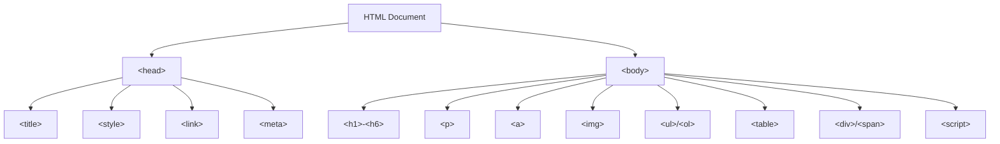
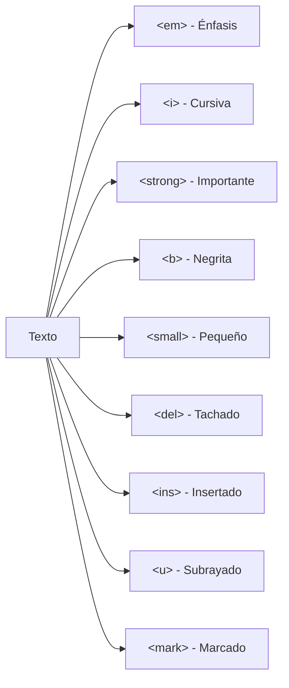
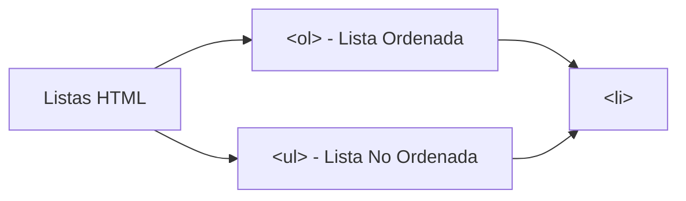
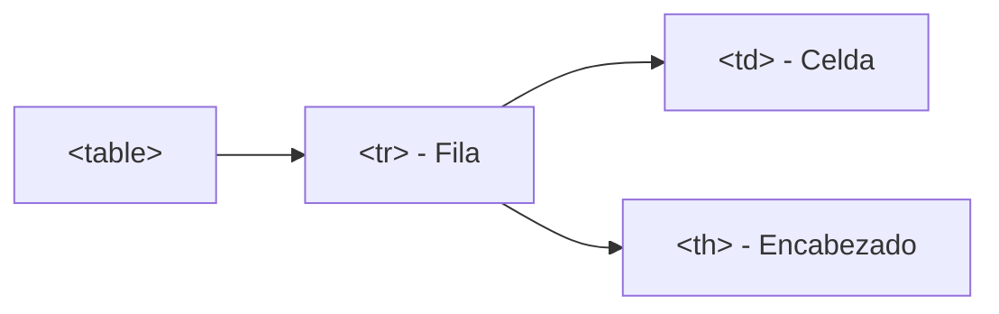

# Mi Biografia

**Módulo:** `HTML Básico` | **Lección:** adultez

# Federico Garay

## Mi biografía

### Adultez

{width=35%}

Estaba decidido, iba a ser psicólogo. Sin dudarlo estudié y me recibí. Al mismo tiempo estudiaba Artes Plásticas, porque como dije, me gustaba mucho dibujar, pero eso se fue perdiendo. 

El mismo año en que me recibí de psicólogo me casé con mi actual esposa Natacha y tuvimos a nuestra primera hermosa hija, Milena. A los 3 años llegó la divina Juana, y la familia ya estaba completa. 

Al mismo tiempo aparecieron las computadoras en mi vida, las que me volvieron loco. Cada nuevo adelanto me asombraba como a un niño, y aún me sigo sintiendo así. A lo largo de toda mi carrera profesional nunca dejé de fascinarme: programación, ofimática, videojuegos, diseño gráfico… todo me atrapaba con pasión. 

Trabajé durante 20 años como psicólogo clínico, pero algo me decía que eso no era todo. Necesitaba ayudar de un modo distinto, llegar a más personas, tocar más vidas. Así fue que apareció Udemy, trayendo la oportunidad de monetizar mis hobbies, enseñando al mundo las habilidades que aprendí jugando. Hoy soy instructor full time, y me considero libre, porque trabajo donde quiero y cuando quiero, y recibo el amor de más de 150.000 estudiantes de todos los puntos del mundo, que cada tanto me dicen cosas como "Fede, gracias a tu curso conseguí un trabajo mejor", y te juro que nada me puede hacer más feliz. 

 [Inicio](index.html) 
 [Infancia](infancia.html)  [Adolescencia](Adolescencia.html)

## 📊 Diagrama Conceptual

## 🔗 Enlaces Relacionados

### En este módulo
- [[Mi Primera Página]]
- [[Mis etiquetas]]
- [[Etiquetas anidadas]]
- [[Texto ordenado]]
- [[Texto ordenado]]
- [[Agregar Imágenes]]
- [[Enlaces]]
- [[Mi Biografia]]
- [[Pagina 2]]
- [[Mi Biografia]]
- [[Mi Biografia]]

### Navegación del curso
- ➡️ Módulo siguiente: [[HTML Intermedio]]
- 🏠 Volver al [[Índice del Curso]]
