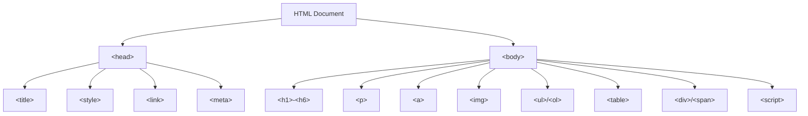
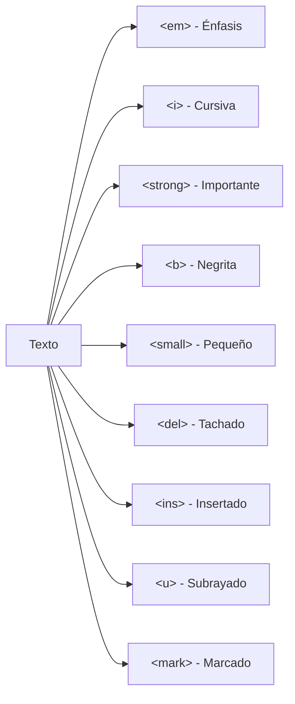
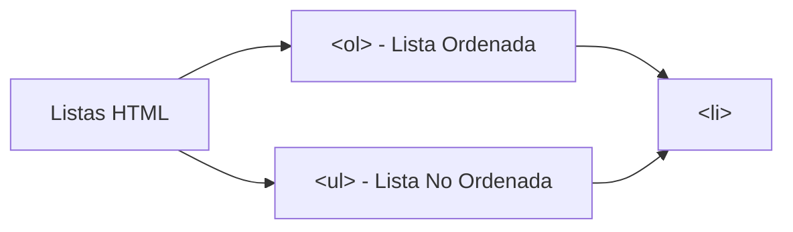
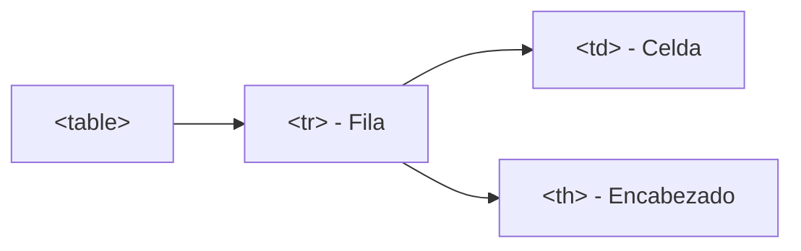

# Mi Biografia

**Módulo:** `HTML Básico` | **Lección:** infancia

# Federico Garay

## Mi biografía

### Infancia

{width=35%}

Me recuerdo a mi mismo como un morochito tan flaco que me decían que no alcanzaba ni a proyectar sombra. Era bastante tímido pero los que me conocían de cerca decían que era muy gracioso. Creo que desde entonces siento mucho placer cada vez que hago reír a alguien. 

Yo era el mayor de los hijos, y me la pasaba jugando/peleando con mis hermanas hasta que muchos años después llegó mi hermano menor, quien se convirtió de inmediato en mi juguete favorito. 

Si de algo estoy seguro es de que nunca supe jugar bien al futbol. Era tan desastroso que cuando se armaban los equipos en el barrio, todos peleaban por no tenerme con ellos. Por suerte en lo que siempre fui muy bueno fue en reírme de mi mismo, y supongo que ese fue un gran aspecto que me ayudó a desarrollar una personalidad fuerte. 

 [Inicio](index.html) 
 [Adolescencia](adolescencia.html)  [Adultez](adultez.html)

## 📊 Diagrama Conceptual

## 🔗 Enlaces Relacionados

### En este módulo
- [[Mi Primera Página]]
- [[Mis etiquetas]]
- [[Etiquetas anidadas]]
- [[Texto ordenado]]
- [[Texto ordenado]]
- [[Agregar Imágenes]]
- [[Enlaces]]
- [[Mi Biografia]]
- [[Pagina 2]]
- [[Mi Biografia]]
- [[Mi Biografia]]

### Navegación del curso
- ➡️ Módulo siguiente: [[HTML Intermedio]]
- 🏠 Volver al [[Índice del Curso]]
