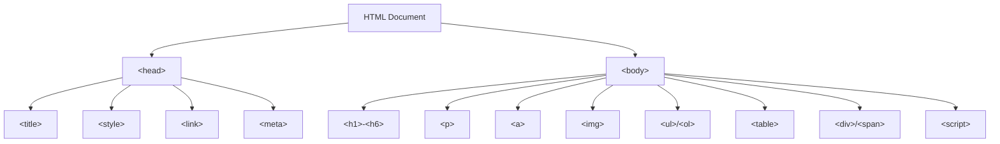

# HTML Básico

## 📊 Diagrama del Módulo

## Lecciones

- [[Mi Primera Página]]
- [[Mis etiquetas]]
- [[Etiquetas anidadas]]
- [[Texto ordenado]]
- [[Texto ordenado]]
- [[Agregar Imágenes]]
- [[Enlaces]]
- [[Mi Biografia]]
- [[Pagina 2]]
- [[Mi Biografia]]
- [[Mi Biografia]]
- [[Mi Biografia]]

---

[🏠 Índice del Curso](../index.md) | [[HTML Intermedio]] ➡️
