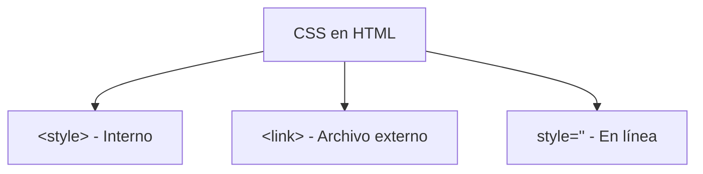

# DIV y SPAN

**Módulo:** `HTML Intermedio` | **Lección:** 04

## Operaciones matemáticas

Las matemáticas son importantes.

Nos permiten hacer cálculos.

Estas son algunas de las más básicas:

5 + 8 = 13 10 - 6 = 4 3 x 10 = 30

Existen muchas operaciones distintas.

Pronto veremos otras más complejas.


## 📊 Diagrama Conceptual



```mermaid
graph TD
    A[Selectores CSS] --> B[Por etiqueta: p, h1]
    A --> C[Por clase: .clase]
    A --> D[Por ID: #id]
    A --> E[Por atributo: [type]]
    A --> F[Combinadores]
    F --> G[Descendiente: div p]
    F --> H[Hijo: div > p]
    F --> I[Adyacente: div + p]
    F --> J[General: div ~ p]
```


## 🔗 Enlaces Relacionados

### En este módulo
- [[Estilo de Texto]]
- [[Document Object Model]]
- [[Etiqueta de Estilo]]
- [[Clases de Estilo]]
- [[Selectores]]
- [[Combinadores]]
- [[Combinadores]]
- [[Mi Biografia]]
- [[Etiqueta de Estilo]]
- [[Mi Biografia]]
- [[Mi Biografia]]
- [[Mi Biografia]]

### Navegación del curso
- ⬅️ Módulo anterior: [[HTML Básico]]
- ➡️ Módulo siguiente: [[Variables]]
- 🏠 Volver al [[Índice del Curso]]
