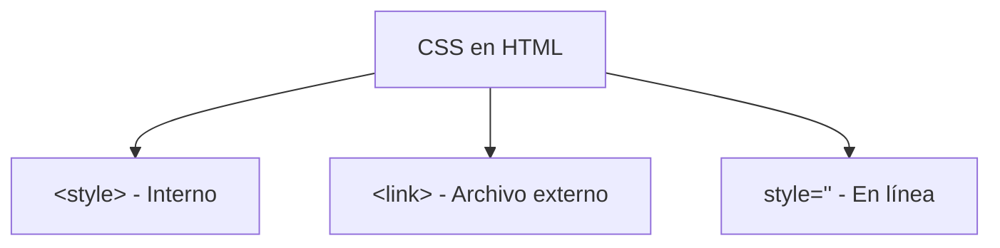

# Selectores

**Módulo:** `HTML Intermedio` | **Lección:** 05

# Enlaces recomendados

Los siguientes enlaces contienen las fuentes de nuestro artículo. No deje de visitarlos en caso de dudas o necesidad de ampliación de la información brindada en el artículo. Por favor considere que la información brindada en los respectivos enlaces puede cambiar luego de haberse publicado nuestro artículo. Los enlaces destacados pertenecen a sitios educativos

- Google
- UNC
- YouTube
- UNCUYO

Todos los derechos están reservados


## 📊 Diagrama Conceptual



```mermaid
graph TD
    A[Selectores CSS] --> B[Por etiqueta: p, h1]
    A --> C[Por clase: .clase]
    A --> D[Por ID: #id]
    A --> E[Por atributo: [type]]
    A --> F[Combinadores]
    F --> G[Descendiente: div p]
    F --> H[Hijo: div > p]
    F --> I[Adyacente: div + p]
    F --> J[General: div ~ p]
```


## 🔗 Enlaces Relacionados

### En este módulo
- [[Estilo de Texto]]
- [[Document Object Model]]
- [[Etiqueta de Estilo]]
- [[Clases de Estilo]]
- [[DIV y SPAN]]
- [[Combinadores]]
- [[Combinadores]]
- [[Mi Biografia]]
- [[Etiqueta de Estilo]]
- [[Mi Biografia]]
- [[Mi Biografia]]
- [[Mi Biografia]]

### Navegación del curso
- ⬅️ Módulo anterior: [[HTML Básico]]
- ➡️ Módulo siguiente: [[Variables]]
- 🏠 Volver al [[Índice del Curso]]
