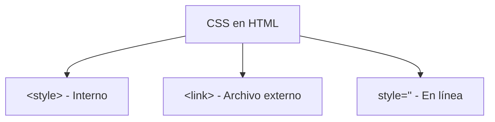

# Combinadores

**Módulo:** `HTML Intermedio` | **Lección:** 07

# Mi lista

### Una lista de cosas

## Gran subtitulo

### Subtitulo menor 1

Este párrafo está dentro de la etiqueta div. Este también.

Pero este no

### Subtítulo menor 2

1. Primer elemento
1. Segundo elemento
1. Tercer elemento

Este es el pie de página

Gracias


## 📊 Diagrama Conceptual



```mermaid
graph TD
    A[Selectores CSS] --> B[Por etiqueta: p, h1]
    A --> C[Por clase: .clase]
    A --> D[Por ID: #id]
    A --> E[Por atributo: [type]]
    A --> F[Combinadores]
    F --> G[Descendiente: div p]
    F --> H[Hijo: div > p]
    F --> I[Adyacente: div + p]
    F --> J[General: div ~ p]
```


## 🔗 Enlaces Relacionados

### En este módulo
- [[Estilo de Texto]]
- [[Document Object Model]]
- [[Etiqueta de Estilo]]
- [[Clases de Estilo]]
- [[DIV y SPAN]]
- [[Selectores]]
- [[Combinadores]]
- [[Mi Biografia]]
- [[Etiqueta de Estilo]]
- [[Mi Biografia]]
- [[Mi Biografia]]
- [[Mi Biografia]]

### Navegación del curso
- ⬅️ Módulo anterior: [[HTML Básico]]
- ➡️ Módulo siguiente: [[Variables]]
- 🏠 Volver al [[Índice del Curso]]
