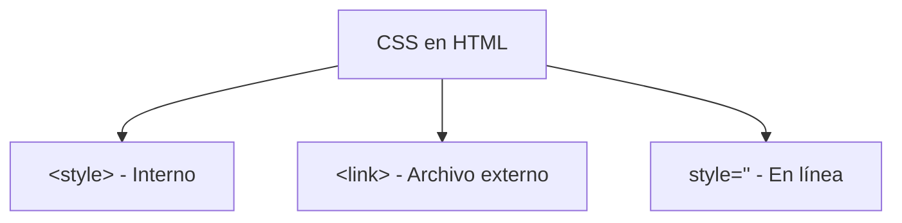

# Mi Biografia

**Módulo:** `HTML Intermedio` | **Lección:** 08

Federico Garay Mi biografía Presentación

{width=15%}

Si vas a leer mi historia, prefiero que me digas Fede. No creo que haya nada especial en mi como para escribir una biografía, pero creo que siempre vale la pena repasar el camino que hemos hecho, celebrar a las personas que nos han acompañado, y valorar lo bueno y lo malo que nos ha sucedido. 

Por lo pronto, estos son mis datos duros: 
 Nombre : Federico Leandro Garay 
 Fecha de Nacimiento : 05/03/1976 
 Padres : Oscar y Cristina 
 Hermanos : Yeni, Marcela y Pepo 
 Esposa : Natacha 
 Hijas : Milena y Juana 
 Perros : Reina y Simba

Infancia Adolescencia Adultez


## 📊 Diagrama Conceptual



```mermaid
graph TD
    A[Selectores CSS] --> B[Por etiqueta: p, h1]
    A --> C[Por clase: .clase]
    A --> D[Por ID: #id]
    A --> E[Por atributo: [type]]
    A --> F[Combinadores]
    F --> G[Descendiente: div p]
    F --> H[Hijo: div > p]
    F --> I[Adyacente: div + p]
    F --> J[General: div ~ p]
```


## 🔗 Enlaces Relacionados

### En este módulo
- [[Estilo de Texto]]
- [[Document Object Model]]
- [[Etiqueta de Estilo]]
- [[Clases de Estilo]]
- [[DIV y SPAN]]
- [[Selectores]]
- [[Combinadores]]
- [[Combinadores]]
- [[Etiqueta de Estilo]]
- [[Mi Biografia]]
- [[Mi Biografia]]
- [[Mi Biografia]]

### Navegación del curso
- ⬅️ Módulo anterior: [[HTML Básico]]
- ➡️ Módulo siguiente: [[Variables]]
- 🏠 Volver al [[Índice del Curso]]
