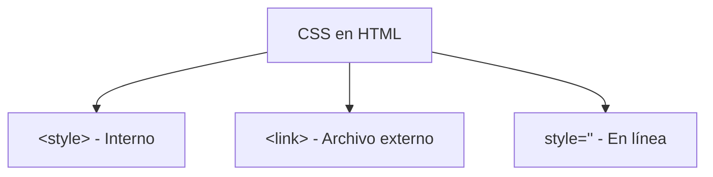

# HTML Intermedio

## 📊 Diagrama del Módulo

## Lecciones

- [[Estilo de Texto]]
- [[Document Object Model]]
- [[Etiqueta de Estilo]]
- [[Clases de Estilo]]
- [[DIV y SPAN]]
- [[Selectores]]
- [[Combinadores]]
- [[Combinadores]]
- [[Mi Biografia]]
- [[Etiqueta de Estilo]]
- [[Mi Biografia]]
- [[Mi Biografia]]
- [[Mi Biografia]]

---

⬅️ [[HTML Básico]] | [🏠 Índice del Curso](../index.md) | [[Variables]] ➡️
