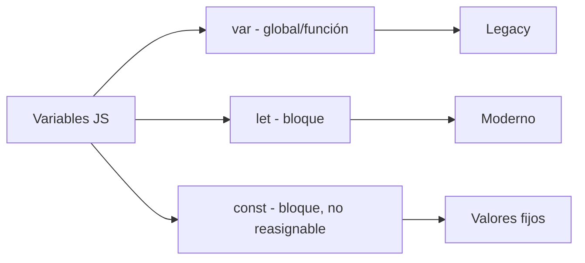
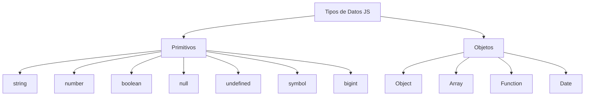

# Ingresos de Usuario

**Módulo:** `Variables` | **Lección:** 05

Ingresa tu nombre

🔹 **Campo** `text`: 

🔹 **Campo** `text`: Ingresar

# No sé tu nombre

## 🧩 Código JavaScript

```javascript
function mostrarNombre(){
                let elementoNombre = document.getElementById("nombreDeUsuario");
                let elementoTexto = document.getElementById("salida");
                let mensaje = "Tu te llamas " + elementoNombre.value
                


                elementoTexto.textContent = mensaje;
            }
```


## 📊 Diagrama Conceptual






## 🔗 Enlaces Relacionados

### En este módulo
- [[Saludo]]
- [[Ingresos de Usuario]]
- [[Variables]]
- [[Tipos de Datos]]
- [[Temporizador]]
- [[Sonidos]]
- [[Fecha y Hora]]
- [[Responde Rápido]]
- [[Concurso de preguntas]]

### Navegación del curso
- ⬅️ Módulo anterior: [[HTML Intermedio]]
- ➡️ Módulo siguiente: [[Funciones]]
- 🏠 Volver al [[Índice del Curso]]
