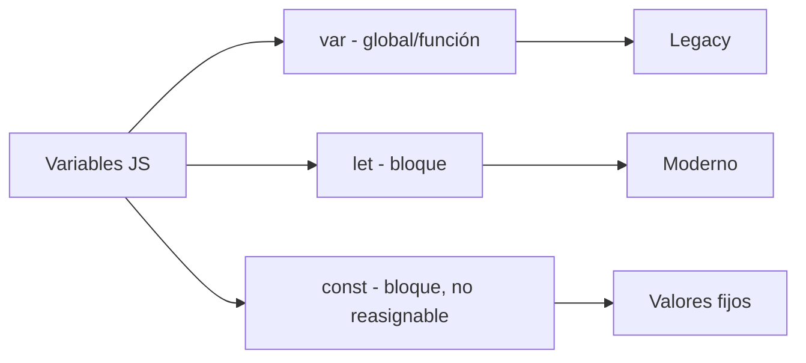
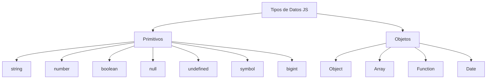

# Temporizador

**Módulo:** `Variables` | **Lección:** 06

🔹 **Campo** `number`: 

🔹 **Campo** `text`: Alarma

# APAGADO

## 🧩 Código JavaScript

```javascript
let elementoSegundos = document.getElementById("tiempoElegido");
            let elementoTextoAlarma = document.getElementById("textoAlarma");

            function comenzarTiempo(){
                setTimeout(tiempoCumplido, 1000 * elementoSegundos.value);
            }

            function tiempoCumplido(){
                elementoTextoAlarma.textContent = "ENCENDIDO";
                elementoTextoAlarma.style.color = "green";
            }
```


## 📊 Diagrama Conceptual






## 🔗 Enlaces Relacionados

### En este módulo
- [[Saludo]]
- [[Ingresos de Usuario]]
- [[Variables]]
- [[Tipos de Datos]]
- [[Ingresos de Usuario]]
- [[Sonidos]]
- [[Fecha y Hora]]
- [[Responde Rápido]]
- [[Concurso de preguntas]]

### Navegación del curso
- ⬅️ Módulo anterior: [[HTML Intermedio]]
- ➡️ Módulo siguiente: [[Funciones]]
- 🏠 Volver al [[Índice del Curso]]
