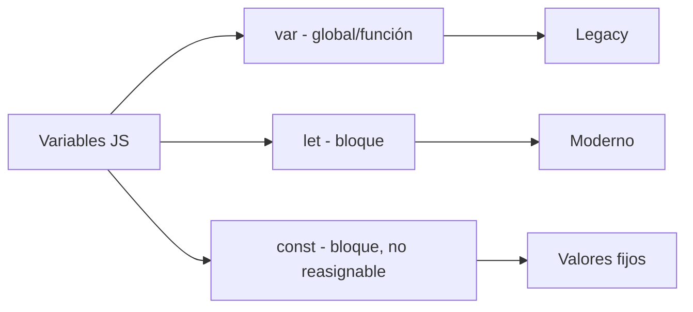
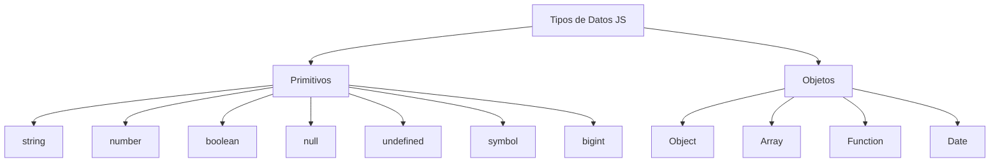

# Responde Rápido

**Módulo:** `Variables` | **Lección:** 09

## Responde a las preguntas lo mas rapido que puedas

1. Cual es la capital de Francia?

🔹 **Campo** `text`: 

2. (7 * 5) + 15

🔹 **Campo** `text`: 

3. Simbolo quimico del agua

🔹 **Campo** `text`: 

4. Año del descubrimiento de america

🔹 **Campo** `text`: 

5. Nombre de los 4 Beatles

🔹 **Campo** `text`: 

🔹 **Campo** `text`: Terminé!

🔹 **Campo** `text`: Volver a Intentar

## 🧩 Código JavaScript

```javascript
let tiempoTerminado;
            let intervaloDeTiempo;

            function comenzarCuentaRegresiva() {
                tiempoTerminado = setTimeout(tiempoCumplido, 30000);
                intervaloDeTiempo = setInterval(ticTac, 1000);

                document.getElementById("cuentaRegresiva").textContent = 30;
            }

            function ticTac() {
                let tiempo = document.getElementById("cuentaRegresiva").textContent;

                document.getElementById("cuentaRegresiva").textContent = tiempo - 1;
            }

            function tiempoCumplido() {
                clearInterval(intervaloDeTiempo);
                document.getElementById("cuentaRegresiva").textContent = 0;
                document.getElementById("audioFinal").play();
                alert("GEAME OVER: Se acabó el tiempo. Intenta nuevamente");
            }

            function finalizado() {
                clearTimeout(tiempoTerminado);
                clearInterval(intervaloDeTiempo);

                let fecha = new Date();
                let respuesta1 = document.getElementById("respuesta1").value;
                let respuesta2 = document.getElementById("respuesta2").value;
                let respuesta3 = document.getElementById("respuesta3").value;
                let respuesta4 = document.getElementById("respuesta4").value;
                let respuesta5 = document.getElementById("respuesta5").value;

                let mensaje = fecha.toLocaleDateString("es-Es") + "\n" +
                                "1. " + respuesta1 + "\n" +
                                "2. " + respuesta2 + "\n" +
                                "3. " + respuesta3 + "\n" +
                                "4. " + respuesta4 + "\n" +
                                "5. " + respuesta5;

                alert(mensaje);
            }

            function volverAIntentar() {
                location.reload();
            }
```


## 📊 Diagrama Conceptual






## 🔗 Enlaces Relacionados

### En este módulo
- [[Saludo]]
- [[Ingresos de Usuario]]
- [[Variables]]
- [[Tipos de Datos]]
- [[Ingresos de Usuario]]
- [[Temporizador]]
- [[Sonidos]]
- [[Fecha y Hora]]
- [[Concurso de preguntas]]

### Navegación del curso
- ⬅️ Módulo anterior: [[HTML Intermedio]]
- ➡️ Módulo siguiente: [[Funciones]]
- 🏠 Volver al [[Índice del Curso]]
