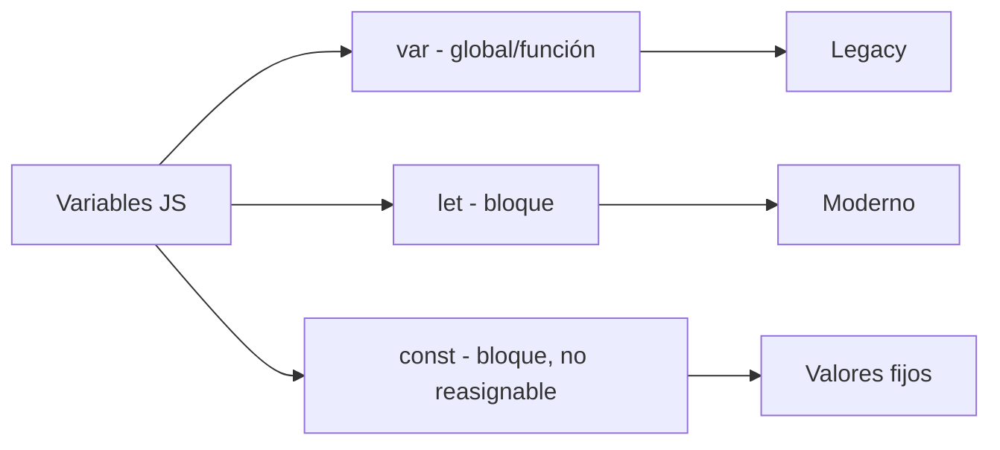
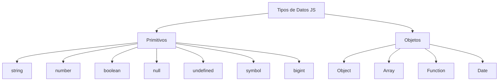

# Concurso de preguntas

**Módulo:** `Variables` | **Lección:** 09

# Concurso de preguntas

Pregunta 1

🔹 **Campo** `text`: 

preguna 2

🔹 **Campo** `text`: 

Pregunta 3

🔹 **Campo** `text`: 

Pregunta 4

🔹 **Campo** `text`: 

Pregunta 5

🔹 **Campo** `text`: 

# 00:00:00

🔹 **Campo** `text`: Enviar

🔹 **Campo** `text`: Reiniciar

## 🧩 Código JavaScript

**Archivo:** `juego.js`

## 📊 Diagrama Conceptual

## 🔗 Enlaces Relacionados

### En este módulo
- [[Saludo]]
- [[Ingresos de Usuario]]
- [[Variables]]
- [[Tipos de Datos]]
- [[Ingresos de Usuario]]
- [[Temporizador]]
- [[Sonidos]]
- [[Fecha y Hora]]
- [[Responde Rápido]]

### Navegación del curso
- ⬅️ Módulo anterior: [[HTML Intermedio]]
- ➡️ Módulo siguiente: [[Funciones]]
- 🏠 Volver al [[Índice del Curso]]
