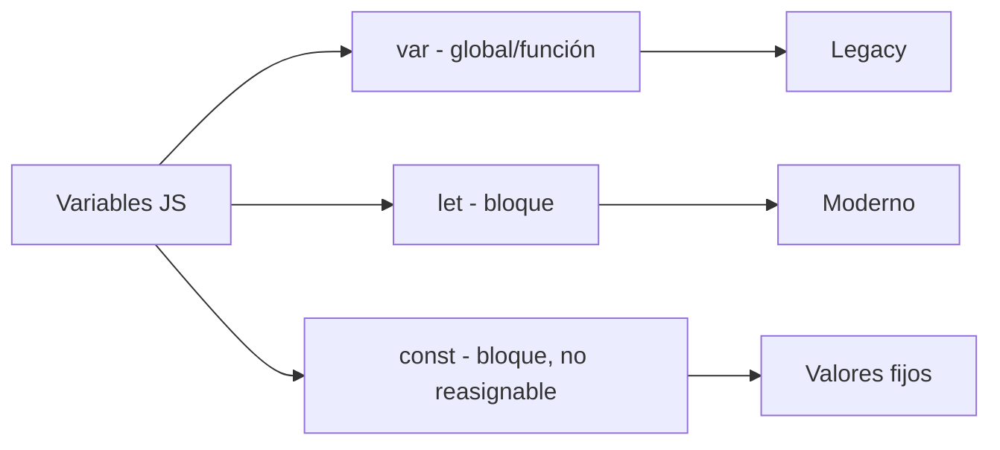

# Variables

## 📊 Diagrama del Módulo

## Lecciones

- [[Saludo]]
- [[Ingresos de Usuario]]
- [[Variables]]
- [[Tipos de Datos]]
- [[Ingresos de Usuario]]
- [[Temporizador]]
- [[Sonidos]]
- [[Fecha y Hora]]
- [[Responde Rápido]]
- [[Concurso de preguntas]]

---

⬅️ [[HTML Intermedio]] | [🏠 Índice del Curso](../index.md) | [[Funciones]] ➡️
