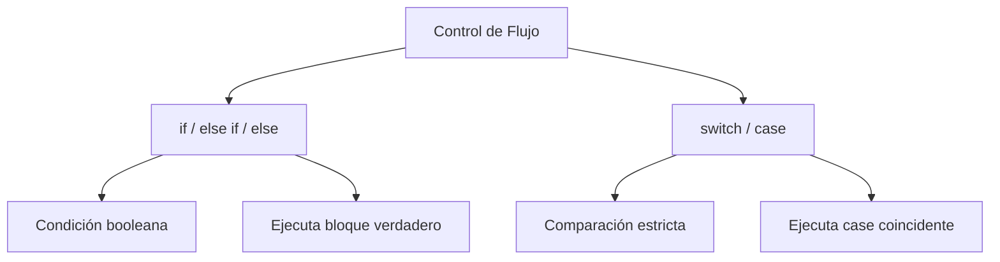

# Tu peso en otro planeta

**Módulo:** `Flujo del Programa` | **Lección:** 01

# Tu peso en otro planeta

Tu peso varia segun el planeta donde estes

## 🧩 Código JavaScript

```javascript
var gTierra = 9.8, gMarte = 3.7, gJupiter = 24.8;
			var pesoTierra = parseInt(prompt("Ingresa tu peso real: "));
			var planeta = parseInt(prompt("Elije 1 para Marte \nElije 2 para Jupiter"));
			var nombrePlaneta;
			if (planeta == 1)
			{
				pesoFinal = parseInt((pesoTierra * gMarte) /gTierra);
				nombrePlaneta = "Marte";
			}
			else if(planeta == 2)
			{
				pesoFinal = parseInt((pesoTierra * gJupiter)/gTierra);
				nombrePlaneta = "Jupiter";
			}
			else 
			{
				pesoFinal = 1000000;
				nombrePlaneta = "Kripton";
			}
			document.write("Tu peso en " + nombrePlaneta + " es: <strong>" + pesoFinal + " Kilos</strong>");
```


## 📊 Diagrama Conceptual



```mermaid
graph LR
    A[Operadores Lógicos] --> B[&& - AND]
    A --> C[|| - OR]
    A --> D[! - NOT]
    B --> E[Ambos verdaderos]
    C --> F[Al menos uno verdadero]
    D --> G[Niega el valor]
```


## 🔗 Enlaces Relacionados

### En este módulo
- [[Operadores Lógicos]]
- [[Declaración IF]]
- [[Declaración IF/ELSE]]
- [[Switch]]
- [[Menú cine]]
- [[Recomendaciones de cine]]

### Navegación del curso
- ⬅️ Módulo anterior: [[Funciones]]
- ➡️ Módulo siguiente: [[Bucles]]
- 🏠 Volver al [[Índice del Curso]]
