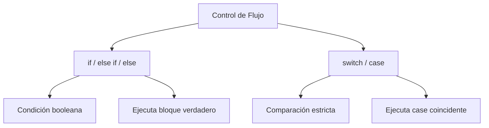

# Declaración IF/ELSE

**Módulo:** `Flujo del Programa` | **Lección:** 03

Precio de la leche

🔹 **Campo** `number`: 

🔹 **Campo** `text`: Enviar

## 🧩 Código JavaScript

**Archivo:** `misScripts.js`


## 📊 Diagrama Conceptual



```mermaid
graph LR
    A[Operadores Lógicos] --> B[&& - AND]
    A --> C[|| - OR]
    A --> D[! - NOT]
    B --> E[Ambos verdaderos]
    C --> F[Al menos uno verdadero]
    D --> G[Niega el valor]
```


## 🔗 Enlaces Relacionados

### En este módulo
- [[Operadores Lógicos]]
- [[Tu peso en otro planeta]]
- [[Declaración IF]]
- [[Switch]]
- [[Menú cine]]
- [[Recomendaciones de cine]]

### Navegación del curso
- ⬅️ Módulo anterior: [[Funciones]]
- ➡️ Módulo siguiente: [[Bucles]]
- 🏠 Volver al [[Índice del Curso]]
