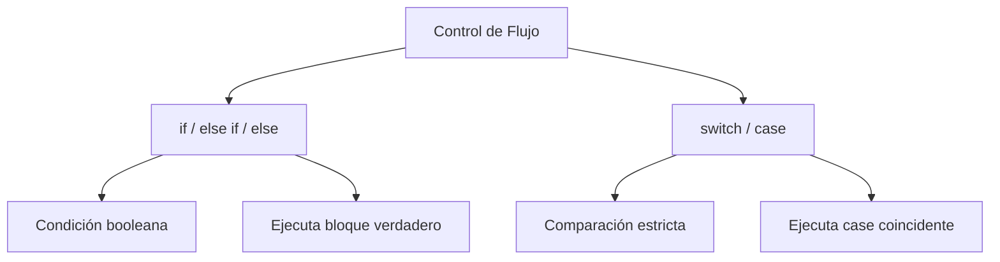

# Recomendaciones de cine

**Módulo:** `Flujo del Programa` | **Lección:** 05

# Obten una recomendacion acorde a tu edad

Ingresa tu edad y selecciona un genero de tu gusto para recibir una recomendacion

Edad Drama Musical Comedia Crimen

### Recomendacion

## 🧩 Código JavaScript

**Archivo:** `cine.js`


## 📊 Diagrama Conceptual



```mermaid
graph LR
    A[Operadores Lógicos] --> B[&& - AND]
    A --> C[|| - OR]
    A --> D[! - NOT]
    B --> E[Ambos verdaderos]
    C --> F[Al menos uno verdadero]
    D --> G[Niega el valor]
```


## 🔗 Enlaces Relacionados

### En este módulo
- [[Operadores Lógicos]]
- [[Tu peso en otro planeta]]
- [[Declaración IF]]
- [[Declaración IF/ELSE]]
- [[Switch]]
- [[Menú cine]]

### Navegación del curso
- ⬅️ Módulo anterior: [[Funciones]]
- ➡️ Módulo siguiente: [[Bucles]]
- 🏠 Volver al [[Índice del Curso]]
