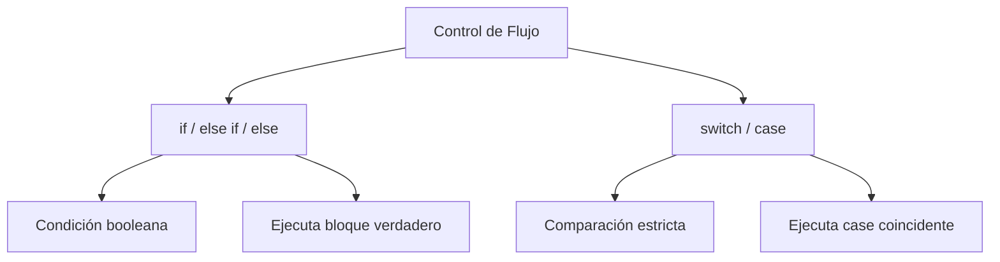

# Flujo del Programa

## 📊 Diagrama del Módulo

## Lecciones

- [[Operadores Lógicos]]
- [[Tu peso en otro planeta]]
- [[Declaración IF]]
- [[Declaración IF/ELSE]]
- [[Switch]]
- [[Menú cine]]
- [[Recomendaciones de cine]]

---

⬅️ [[Funciones]] | [🏠 Índice del Curso](../index.md) | [[Bucles]] ➡️
