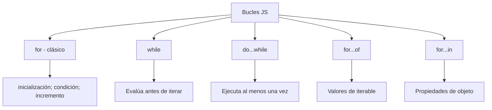
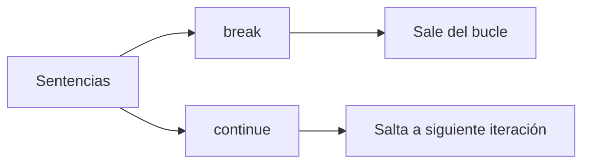

# Fizz Buzz

**Módulo:** `Bucles` | **Lección:** 03

## 🧩 Código JavaScript

**Archivo:** `fizz.js`

## 📊 Diagrama Conceptual

## 🔗 Enlaces Relacionados

### En este módulo
- [[Consola]]
- [[Loop For]]
- [[Tablas de Multiplicar]]
- [[Loop Do... While]]
- [[Titulo del Sitio]]
- [[Loop For Of]]
- [[Break & Continue]]
- [[Etiquetas]]
- [[Boletín Estudiantil]]
- [[Boletin de Calificaciones]]

### Navegación del curso
- ⬅️ Módulo anterior: [[Flujo del Programa]]
- ➡️ Módulo siguiente: [[Proyecto: Tienda de Donas]]
- 🏠 Volver al [[Índice del Curso]]
