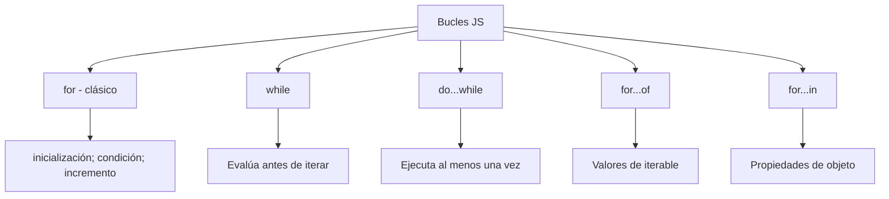
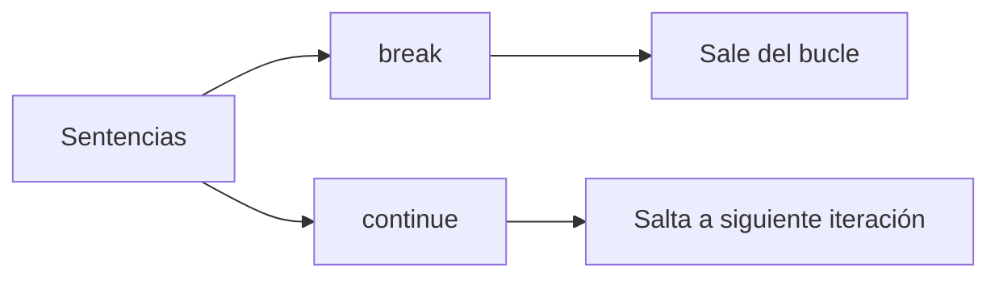

# Break & Continue

**Módulo:** `Bucles` | **Lección:** 07

## 🧩 Código JavaScript

```javascript
let array1 = [1, 5, 24, 95, 11, 10, 62, 15, 9];
            
            for (let numero of array1) {
                if (numero < 50) {
                    document.write(numero + "<br>");
                } else {
                    continue;
                    document.write("numero mayor a 50");
                }
            }

            document.write("Esto es todo");
```


## 📊 Diagrama Conceptual






## 🔗 Enlaces Relacionados

### En este módulo
- [[Consola]]
- [[Loop For]]
- [[Fizz Buzz]]
- [[Tablas de Multiplicar]]
- [[Loop Do... While]]
- [[Titulo del Sitio]]
- [[Loop For Of]]
- [[Etiquetas]]
- [[Boletín Estudiantil]]
- [[Boletin de Calificaciones]]

### Navegación del curso
- ⬅️ Módulo anterior: [[Flujo del Programa]]
- ➡️ Módulo siguiente: [[Proyecto: Tienda de Donas]]
- 🏠 Volver al [[Índice del Curso]]
