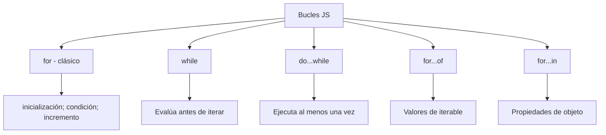
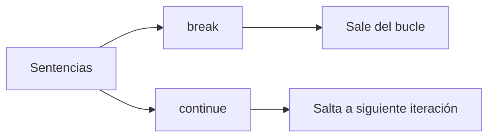

# Etiquetas

**Módulo:** `Bucles` | **Lección:** 08

## 🧩 Código JavaScript

```javascript
let alto = 4;
            let ancho = 3;

            loopExterno:
            for (y = 1; y <= alto; y++) {
                for (x = 1; x <= ancho; x++) {
                    document.write(y + "." + x + "<br>");
                    if (y == 2 && x == 2) {
                        continue loopExterno;
                    }
                }
            }
```


## 📊 Diagrama Conceptual






## 🔗 Enlaces Relacionados

### En este módulo
- [[Consola]]
- [[Loop For]]
- [[Fizz Buzz]]
- [[Tablas de Multiplicar]]
- [[Loop Do... While]]
- [[Titulo del Sitio]]
- [[Loop For Of]]
- [[Break & Continue]]
- [[Boletín Estudiantil]]
- [[Boletin de Calificaciones]]

### Navegación del curso
- ⬅️ Módulo anterior: [[Flujo del Programa]]
- ➡️ Módulo siguiente: [[Proyecto: Tienda de Donas]]
- 🏠 Volver al [[Índice del Curso]]
