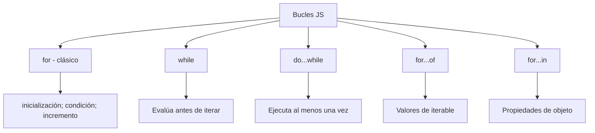

# Bucles

## 📊 Diagrama del Módulo

## Lecciones

- [[Consola]]
- [[Loop For]]
- [[Fizz Buzz]]
- [[Tablas de Multiplicar]]
- [[Loop Do... While]]
- [[Titulo del Sitio]]
- [[Loop For Of]]
- [[Break & Continue]]
- [[Etiquetas]]
- [[Boletín Estudiantil]]
- [[Boletin de Calificaciones]]

---

⬅️ [[Flujo del Programa]] | [🏠 Índice del Curso](../index.md) | [[Proyecto: Tienda de Donas]] ➡️
