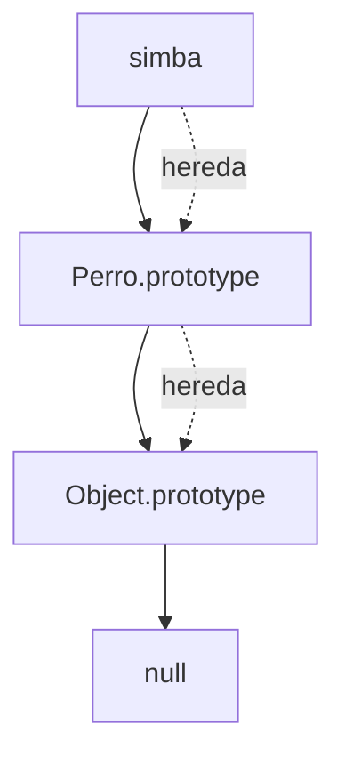

# Prototipos

**Módulo:** `Prototipos` | **Lección:** 01

## 🧩 Código JavaScript

```javascript
let perro = {nombre: 'simba'};
      let perro1 = Object.create(perro);
```


## 📊 Diagrama Conceptual




## 🔗 Enlaces Relacionados

### En este módulo
- [[Objetos Prototípicos]]
- [[Modificar Prototipos]]
- [[Registro Automotor]]
- [[Registro Automoviles]]

### Navegación del curso
- ⬅️ Módulo anterior: [[POO - Objetos]]
- ➡️ Módulo siguiente: [[Clases y Encapsulamiento]]
- 🏠 Volver al [[Índice del Curso]]
