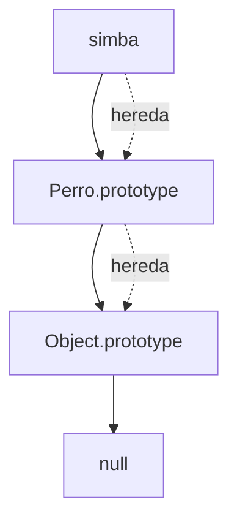

# Objetos Prototípicos

**Módulo:** `Prototipos` | **Lección:** 02

## 🧩 Código JavaScript

```javascript
function Libro(autor, titulo, cantPaginas){
        this.autor = autor;
        this.titulo = titulo;
        this.cantPaginas = cantPaginas;
      }

      let libro1 = new Libro("Stephen King", "Carrie", 524);
```


## 📊 Diagrama Conceptual




## 🔗 Enlaces Relacionados

### En este módulo
- [[Prototipos]]
- [[Modificar Prototipos]]
- [[Registro Automotor]]
- [[Registro Automoviles]]

### Navegación del curso
- ⬅️ Módulo anterior: [[POO - Objetos]]
- ➡️ Módulo siguiente: [[Clases y Encapsulamiento]]
- 🏠 Volver al [[Índice del Curso]]
