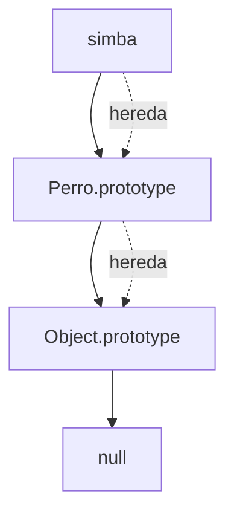

# Modificar Prototipos

**Módulo:** `Prototipos` | **Lección:** 03

## 🧩 Código JavaScript

```javascript
function Libro(autor, titulo, cantPaginas){
        this.autor = autor;
        this.titulo = titulo;
        this.cantPaginas = cantPaginas;
      }

      let libro1 = new Libro("Stephen King", "Carrie", 524);

      Libro.prototype.abrirLibro = function(){
        alert(this.titulo + " ha sido abierto");
      }

      Libro.prototype.edicion = this.edicion;

      function UnObjeto(a) {
        this.a = a;
      }

      UnObjeto.prototype.metodo1 = function(){};
      UnObjeto.prototype.metodo2 = function() {};
```


## 📊 Diagrama Conceptual




## 🔗 Enlaces Relacionados

### En este módulo
- [[Prototipos]]
- [[Objetos Prototípicos]]
- [[Registro Automotor]]
- [[Registro Automoviles]]

### Navegación del curso
- ⬅️ Módulo anterior: [[POO - Objetos]]
- ➡️ Módulo siguiente: [[Clases y Encapsulamiento]]
- 🏠 Volver al [[Índice del Curso]]
