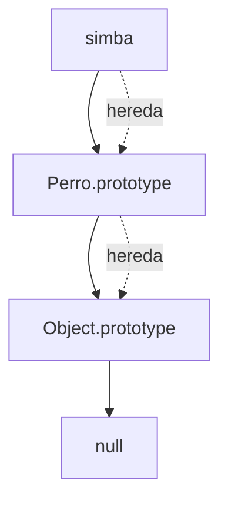

# Registro Automoviles

**Módulo:** `Prototipos` | **Lección:** 05

🔹 **Campo** `text`: Mostrar Registro Automoviles

Registro Automoviles Marca: Modelo: Color: Año: Titular: Registrar Automovil indice de registro: Encender Automovil nuevo titular: Vender Automovil

## 🧩 Código JavaScript

**Archivo:** `registro_automoviles.js`

## 📊 Diagrama Conceptual

## 🔗 Enlaces Relacionados

### En este módulo
- [[Prototipos]]
- [[Objetos Prototípicos]]
- [[Modificar Prototipos]]
- [[Registro Automotor]]

### Navegación del curso
- ⬅️ Módulo anterior: [[POO - Objetos]]
- ➡️ Módulo siguiente: [[Clases y Encapsulamiento]]
- 🏠 Volver al [[Índice del Curso]]
