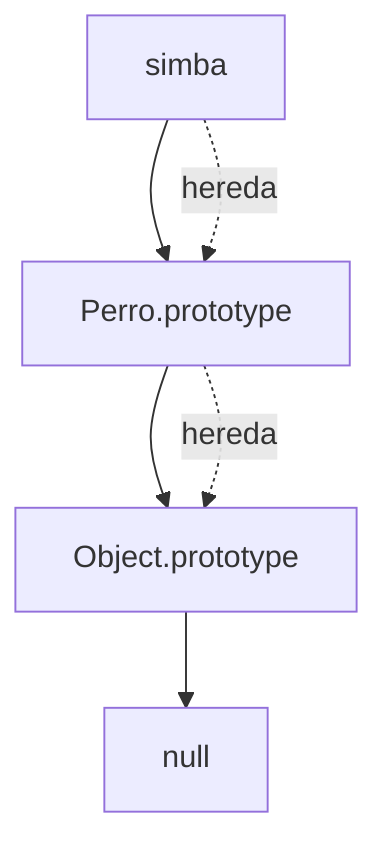

# Prototipos

## 📊 Diagrama del Módulo

## Lecciones

- [[Prototipos]]
- [[Objetos Prototípicos]]
- [[Modificar Prototipos]]
- [[Registro Automotor]]
- [[Registro Automoviles]]

---

⬅️ [[POO - Objetos]] | [🏠 Índice del Curso](../index.md) | [[Clases y Encapsulamiento]] ➡️
