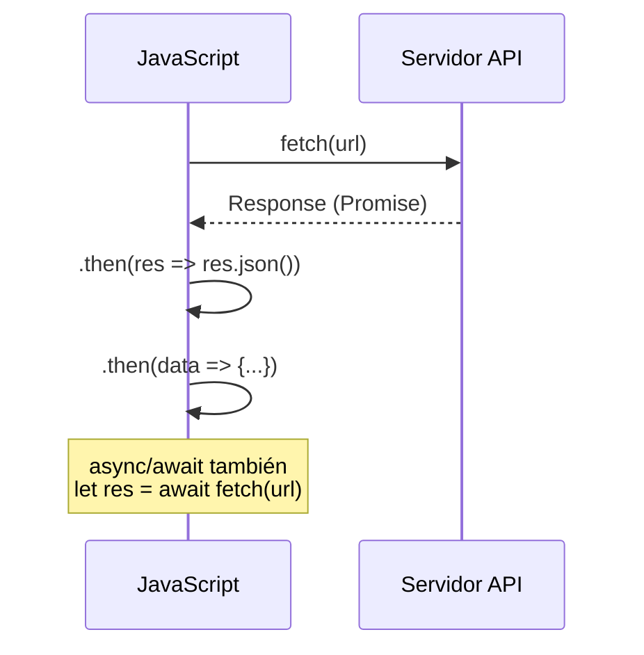

# JSON

**Módulo:** `Manejo de Excepciones y JSON` | **Lección:** 03

## 🧩 Código JavaScript

```javascript
let datosJson;

        fetch('persona.json')
        .then(res => res.json())
        .then((salida) => {
          datosJson = salida;

          let elementoTexto = document.getElementById('nombre');
          elementoTexto.textContent = datosJson.nombre;
        })
        .catch(function(error) {alert(error)})
```


## 📊 Diagrama Conceptual

```mermaid
graph LR
    A[JSON] --> B[JavaScript Object Notation]
    B --> C[Formato de intercambio]
    C --> D[fetch() - Obtener]
    C --> E[JSON.stringify() - Enviar]
    C --> F[JSON.parse() - Leer]
```



```mermaid
flowchart TD
    A[Código] --> B[try]
    B --> C[Código que puede fallar]
    C -->|Error| D[catch(error)]
    C -->|Éxito| E[Sigue normal]
    D --> F[finally - Siempre se ejecuta]
    E --> F
```


## 🔗 Enlaces Relacionados

### En este módulo
- [[JSON]]
- [[JSON]]
- [[Resumen Cuenta Bancaria]]
- [[Banco Springfield]]

### Navegación del curso
- ⬅️ Módulo anterior: [[Clases y Encapsulamiento]]
- ➡️ Módulo siguiente: [[Eventos]]
- 🏠 Volver al [[Índice del Curso]]
