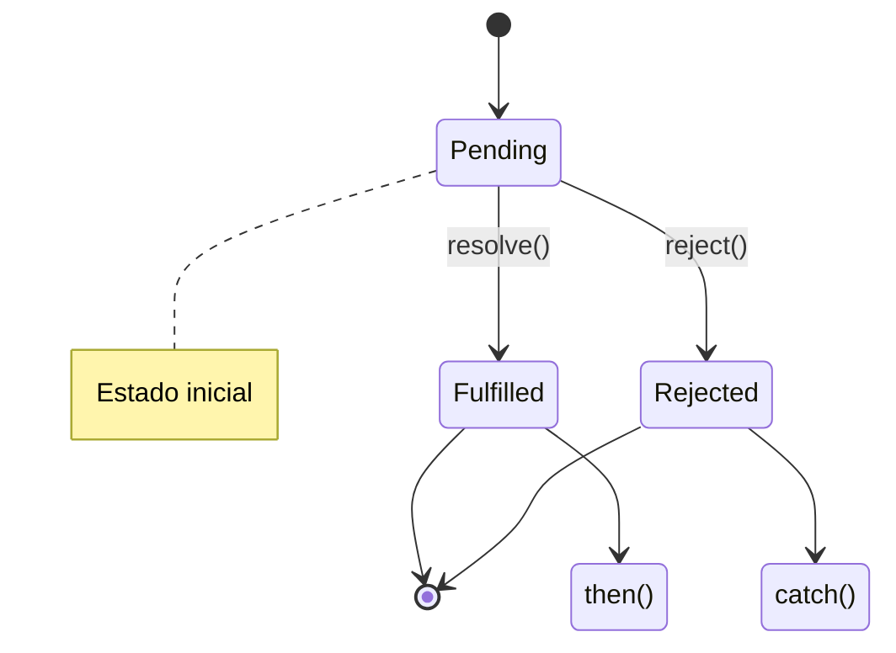
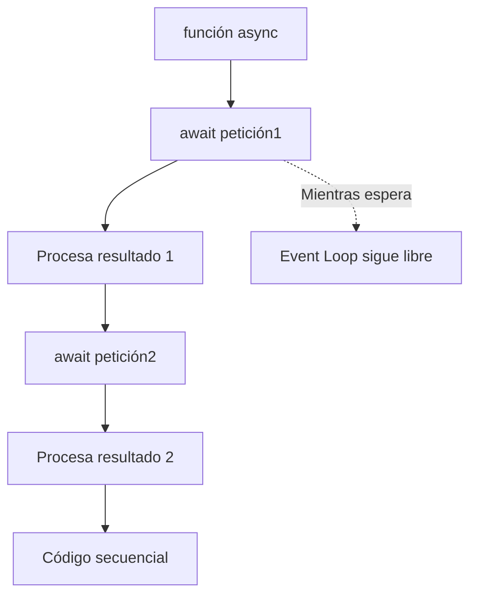
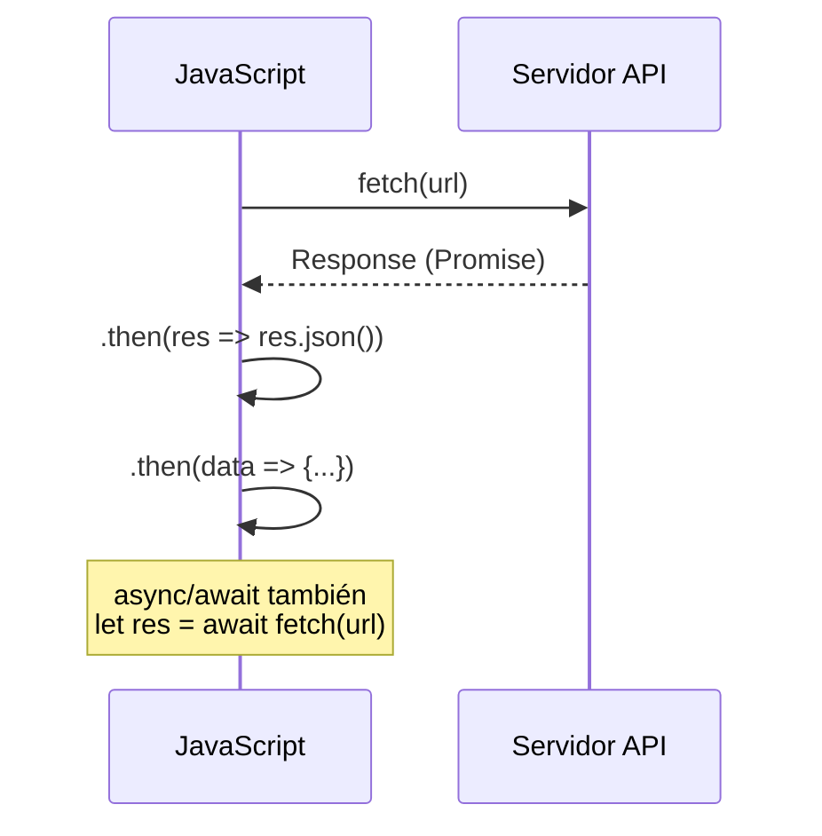

# Sincronía y Asincronpia

**Módulo:** `Promesas y Async/Await` | **Lección:** 01

## 🧩 Código JavaScript

```javascript
//ACCION 1
      console.log("Inicio del codigo sincronico");

      //ACCION 2
      setTimeout(function() {
        for(let i = 0; i < 10; i++) {
          console.log(i);
        }
      }, 0);

      //ACCION 3
      console.log("Fin del codigo sincrono");
```


## 📊 Diagrama Conceptual








## 🔗 Enlaces Relacionados

### En este módulo
- [[Callbacks]]
- [[Promesas]]
- [[Async/Await]]
- [[Manejo de Errores]]
- [[Cotizaciones]]
- [[Cotizaciones BTC]]

### Navegación del curso
- ⬅️ Módulo anterior: [[Eventos]]
- ➡️ Módulo siguiente: [[Frameworks y Librerías]]
- 🏠 Volver al [[Índice del Curso]]
