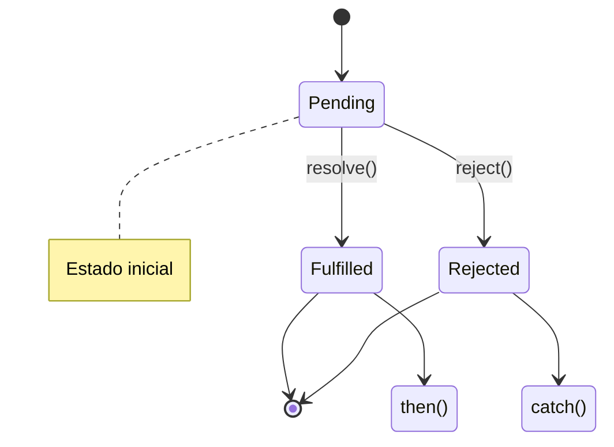
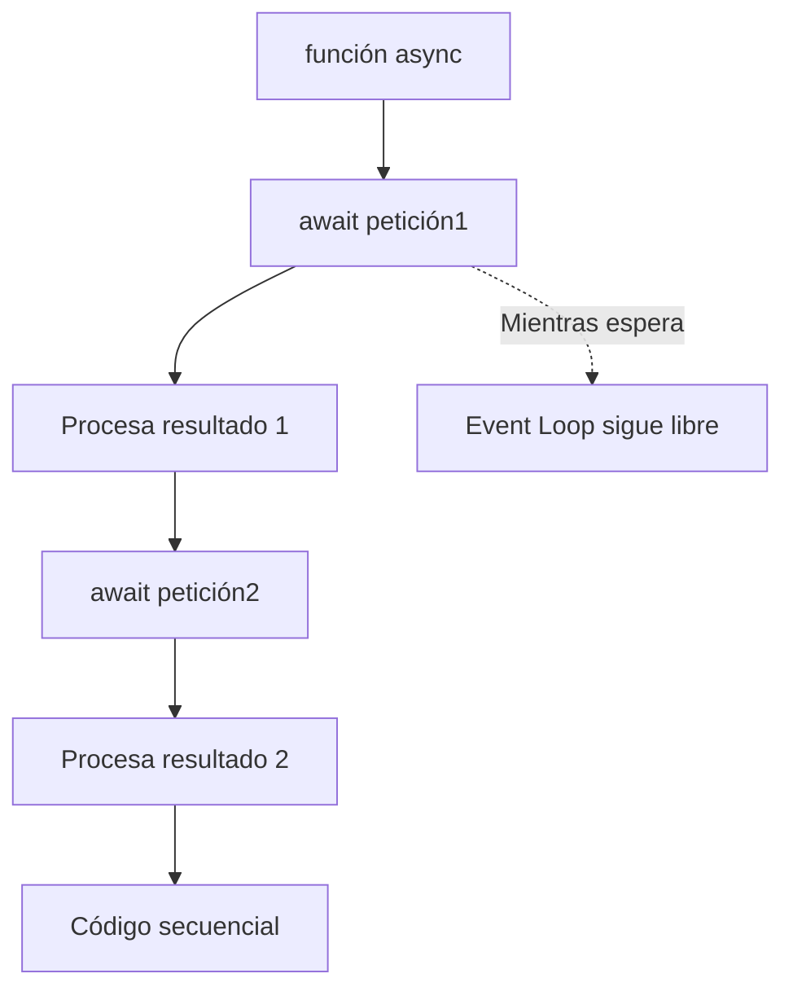
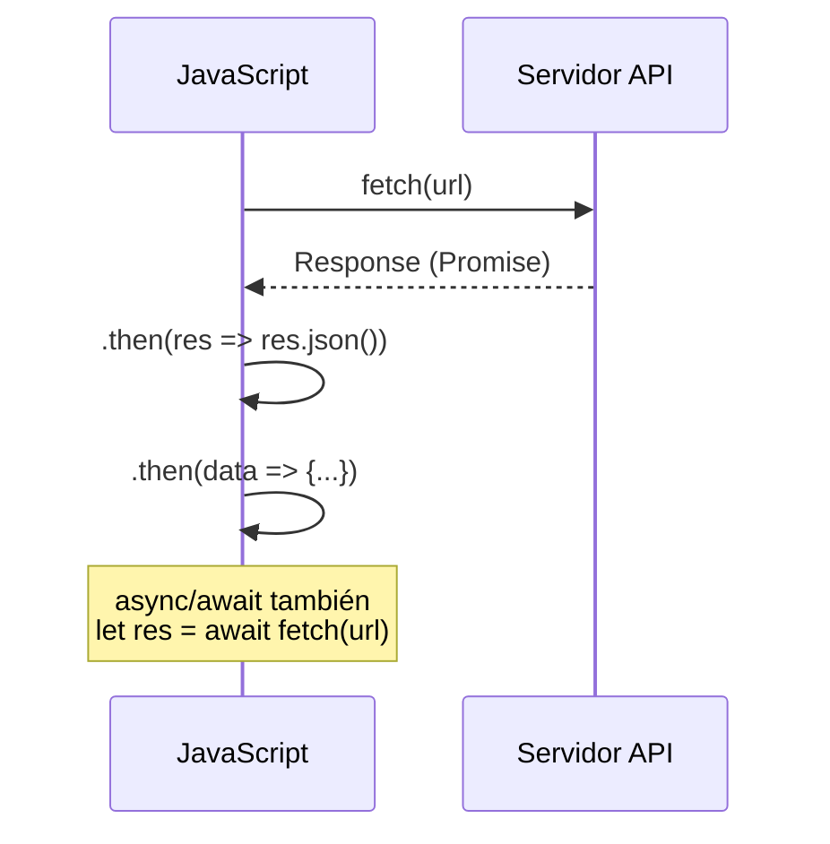

# Promesas

**Módulo:** `Promesas y Async/Await` | **Lección:** 03

## 🧩 Código JavaScript

```javascript
function obtenerUsuarios() {
        return new Promise(function(resolve, reject) {
          let xhr = new XMLHttpRequest();
          xhr.open('GET', 'https://jsonplaceholder.typicode.com/users');
          xhr.onload = function() {
            if(xhr.status === 200) {
              resolve(JSON.parse(xhr.responseText));
            } else {
              reject(xhr.statusText);
            }
          }
          xhr.send();
        });
      }

      obtenerUsuarios()
        .then(function(usuarios) {
          console.log(usuarios);
        })
        .catch(function(error) {
          console.error(error);
        });
```


## 📊 Diagrama Conceptual








## 🔗 Enlaces Relacionados

### En este módulo
- [[Sincronía y Asincronpia]]
- [[Callbacks]]
- [[Async/Await]]
- [[Manejo de Errores]]
- [[Cotizaciones]]
- [[Cotizaciones BTC]]

### Navegación del curso
- ⬅️ Módulo anterior: [[Eventos]]
- ➡️ Módulo siguiente: [[Frameworks y Librerías]]
- 🏠 Volver al [[Índice del Curso]]
